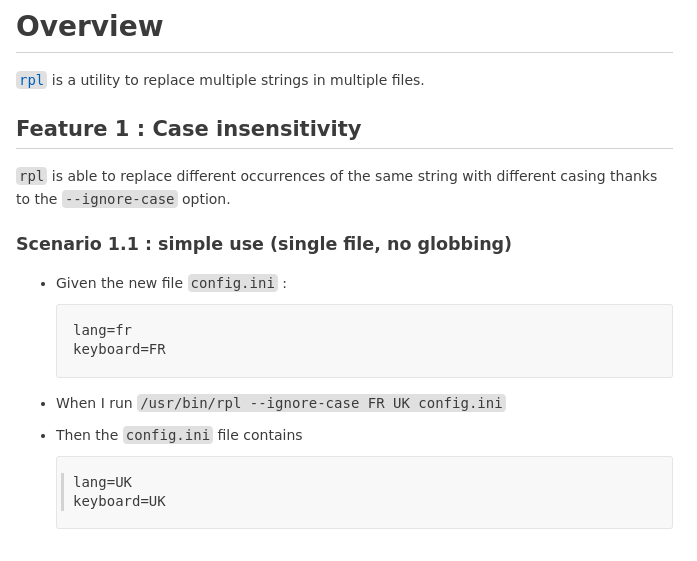

[](https://opensource.org/licenses/Apache-2.0) [](https://alire.ada.dev/crates/bbt.html)


# `bbt` README <!-- omit from toc -->

- [Overview](#overview)
  - [What does the description looks like?](#what-does-the-description-looks-like)
  - [Partial parsing](#partial-parsing)
  - [Step arguments](#step-arguments)
  - [One more example](#one-more-example)
- [Main characteristics](#main-characteristics)
  - [Write once](#write-once)
  - [Tests are easy to read and easy to write](#tests-are-easy-to-read-and-easy-to-write)
  - [Tests are easy to run](#tests-are-easy-to-run)
  - [Test Results are immediately publishable](#test-results-are-immediately-publishable)
- [Objective of the project](#objective-of-the-project)
- [Status of the project](#status-of-the-project)
- [Installation](#installation)
- [Help and comments](#help-and-comments)
- [Further reading](#further-reading)

## Overview

bbt is a simple tool to black box check the behavior of an executable through [Command Line Interface (CLI)](https://en.wikipedia.org/wiki/Command-line_interface).
Hence the name : bbt stands for *Black Box Tester*.  
bbt targets both *specification of the behavior* and *end-to-end test automation*.  

**The outstanding feature of btt is that it directly uses your behavior documentation as the test script.**  
There is no other file to write.

### What does the description looks like?

The behavior is described in almost natural english using the [BDD](https://en.wikipedia.org/wiki/Behavior-driven_development) usual pattern *Given / When / Then*.  
Here is a minimal example :  

### Scenario: I want to know gcc version  <!-- omit from toc -->

- When I run `gcc --version`
- Then the output contains `14.2.0`


It is written in Markdown:  
```md
### Scenario: I want to know gcc version

- When I run `gcc --version`
- Then the output contains `14.2.0`
```  

bbt is about documentation and simplicity, Markdown[¹] is a perfect fit.  

Lets consider a slightly more complete example :


(Markdown source [here](docs/examples/rpl_case_insensitivity.md))

We have :

1. An "Overview" header and a first text   
   All this is ignored, because : 
   - bbt processes **only** Gherkin headers *# Features*, *# Background*, and *# Scenario* or *# Example*.   
   - bbt considers all text lines as comment, except Step lines.  
   
   bbt staying out of the way, you're free to use almost without constraints markdown to draft nice documentations. 
   
1. A "Feature" and a "Scenario" header (followed by the feature/scenario name)  
   bbt is now awake, and waiting for step lines.  
   Note that header's level is ignored (*#### Scenario*, is equal to *# Scenario* for bbt), you're free to structure the file as you want. 

2. Steps  
   Steps are line starting with *- Given*, *- When*, *- Then*, *- And*, *- But*, that contains the things to check or do.

### Partial parsing 

A distinctive feature of bbt is that it directly understand those almost normal english sentences like :  
```
- When I run `sut --quiet input.txt`
- Then I have no output
```
This is achieved thanks to a [partial parser](https://devopedia.org/natural-language-parsing). It means that bbt take into account only some keywords to recognize the skeleton of the sentence, but does not understand the whole sentence.  

So when you write :  
> - When I run `gcc --version`  
> - Then I get `version 15.0.0` (Fix #2398 and #2402)    

bbt actually reads :  
> - when run `gcc --version`   
> - then get `version 15.0.0`     
  
And this is what gives the ability to write steps in natural language. 

### Step arguments

Like [MDG](https://github.com/cucumber/gherkin/blob/main/MARKDOWN_WITH_GHERKIN.md#markdown-with-gherkin), bbt uses [fenced code blocks](https://spec.commonmark.org/0.31.2/#fenced-code-blocks), that is a text between two "```" lines, to describe a multiline text (expected output, file content, etc).

bbt also uses Markdown [code span](https://spec.commonmark.org/0.31.2/#code-spans), that is string between backticks, to identify one line text like file name or command to run.  
It's not only because it makes the doc nicer, but also because otherwise it would be impossible to distinguish arguments from free text.  
 
Note that steps accepting a fenced code block, like  :  
> - Then the output contains  
>   ```   
>   20 files processed   
>   ```    

also accept the code span shortcut when there is only one line.  
`` - Then the output contains `20 files processed` ``  

### One more example

[This example](docs/examples/gcc_hello_word.md) shows how simple it is to run a `gcc` sanity test, that compile and run the ubiquitous *Hello Word*.

> [!NOTE]
> bbt is fully tested with bbt since 0.0.4 version.
> bbt own tests are based on features descriptions indexed [here](docs/tests/features_results.md).

## Main characteristics

### Write once

Specification is the only source of truth. This is bbt most interesting feature, there is nothing else : no intermediate representation, no glue code, no scripting language, no duplication of the original source at all.  

With two main consequences : 
1. writing those tests is a matter of minutes,
2. there is no more place for a discrepancy between documentation and tests.

Alternative tools exists, some are mentioned in [my quick overview of some comparable tools](docs/comparables.md), but as far as i know, **bbt is the only one to provide such a direct "run the doc" approach**.

### Tests are easy to read and easy to write

bbt uses a limited english subset, with a vocabulary dedicated to test with keywords like *run*, *output*, *contains*, etc.
But this limited english subset does not come at the cost of limited readability or expressiveness: 

- First, bbt is reading only specifics line in the specification, the rest of the file is yours : you can give as much context as you want, using all Markdown (and Markdown extensions) possibilities, including graphics (Give a try to [Mermaid](https://mermaid.js.org/intro/)).

- Second, thanks to the partial parser, you can write real, readable English sentences, so that it's almost impossible to guess that the text is also a script;

A direct consequence of that simple model is that the specifications / scenarios may be written by non-coders

Although simple, you don't have to learn this subset by heart, you may ask for a template by running `bbt -ct` (or --create_template), and ask for the complete grammar with `bbt -lg` (or --list_grammar).  

### Tests are easy to run

To run a scenario : `bbt my_scenario.md`  
Or to run all the md files in the *tests* tree `bbt -r tests`  

bbt has no dependencies on external lib or tools (diff, for example), to ensure that it can be run on most platforms.  

### Test Results are immediately publishable 

bbt can output a **Tests results index** Markdown file, that cross-references the executed scenario files : if a test fail, just click on the link and you are in the scenario.  
You can push it on github without further processing.  

To see what it looks like, consider [bbt own tests](docs/tests/features_results.md).  

Tests results are generated when running `bbt`, by just using the `-o` option (--output).

## Objective of the project 

bbt project aim at exploring how far we can push the "specification in natural language is the single source of truth" motto, while maintaining the main feature : ease of use. 

**If a newbie is able to use btt in a quarter of an hour, and an experienced user is able to write and run a test in less than 3 minutes, with no need to rewrite or post-process the generated documentation, I'll consider it as a great success.**    

bbt has a precise scope: it is dedicated to Command Line Interface, taking some input and producing some output.
Keep in mind that it is not meant for specifying or testing UI, complex systems, unit testing, API, etc.  
Using a natural language description for those kind of tests is a very tempting way to explore, but implementation may be an order of magnitude more complex, and this is out of bbt current scope.   

## Status of the project

bbt is in an early stage, meaning that interface and behavior are subject to changes.  
Feel free to make suggestions [in bbt discussions](https://github.com/LionelDraghi/bbt/discussions). 

The code has grown fast in the first three months, and is far from being clean.  
Nevertheless, bbt is working. 
It has as a serious [test base](docs/tests/features_results.md).  
In real life, the [acc](https://github.com/LionelDraghi/ArchiCheck) project has started the migration of its large tests base to bbt.  

btt compile on Linux, Windows and Mac OS (at least the Alire version), but is currently tested only on Linux (my dev. platform) and Windows.

On Windows, 3 tests fail (3 out of 65 on version 0.0.6), 2 because of expected output containing Unix style path, and one relative to escaping command line written for Linux.
I'm not yet able to specify per platform expected results, so this is not going to be fixed quickly. 
That said, I'm not aware of any Windows specific bug.

## Installation

[](https://alire.ada.dev/crates/bbt.html) is available thanks to the Alire package manager.  
1. To install Alire on your platform, refer to [Alire](https://alire.ada.dev/)  
   
2. Then to install bbt :
   ```sh
   alr get bbt  
   cd bbt  
   alr build  
   ```

4. Move the bbt exec somewhere in your PATH

Or, to get the latest version :
```sh
git clone https://github.com/LionelDraghi/bbt  
cd bbt  
alr build 
```
(if you don't want to install alr, just run `gprbuild` instead of `alr build`) 

## Help and comments
Comments are welcome [here](https://github.com/LionelDraghi/bbt/discussions)

## Further reading
- [User Guide](docs/UG.md): concepts, command, features...
- [Developer Guide](docs/developer_guide.md) : design overview, issues, fixme...
- [References](docs/references.md) : syntax, grammar, and more details on non obvious behavior
- [Project status](docs/project.md): changelog, tests, TDL...
- [Command line help](docs/bbt_help.md)

[¹]: More precisely, this is a subset of the existing [Markdown with Gherkin (MDG)](https://github.com/cucumber/gherkin/blob/main/MARKDOWN_WITH_GHERKIN.md#markdown-with-gherkin) format.  

