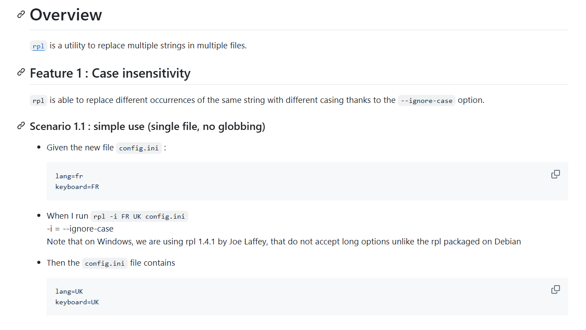

# *bbt* README <!-- omit from toc -->

[](https://alire.ada.dev/crates/bbt.html) [](https://opensource.org/licenses/Apache-2.0)

[](https://ada-lang.io/)
[](https://blog.adacore.com/ada-spark-crate-of-the-year-2024-winners-announced) 

[](docs/tests_results/Linux/features_results.md) 
[](docs/tests_results/Darwin/features_results.md)
[](docs/tests_results/Windows/features_results.md) 

---
- [Overview](#overview)
  - [What does the behavior description look like?](#what-does-the-behavior-description-look-like)
  - [Partial parsing](#partial-parsing)
  - [One more example](#one-more-example)
- [Installation](#installation)
  - [Stable version](#stable-version)
  - [Latest version](#latest-version)
    - [Building from sources](#building-from-sources)
    - [AppImage (Linux only)](#appimage-linux-only)
- [First use](#first-use)
- [Why should I use *bbt*?](#why-should-i-use-bbt)
  - [Write once](#write-once)
  - [Write real documentation, not just a ".feature" Gherkin file](#write-real-documentation-not-just-a-feature-gherkin-file)
  - [Be proficient in no time](#be-proficient-in-no-time)
  - [No-fuss, no-wait run](#no-fuss-no-wait-run)
  - [Ready-to-publish output](#ready-to-publish-output)
- [Status of the project](#status-of-the-project)
- [Help and comments](#help-and-comments)
- [Further reading](#further-reading)

## Overview

*bbt* is a simple tool for black box check the behavior of an executable through the [Command Line Interface (CLI)](https://en.wikipedia.org/wiki/Command-line_interface).  
Hence the name: *bbt* stands for *Black Box Tester*.  

*bbt* targets both *behavior specification* and *end-to-end test automation* for the very common case of apps taking some input and producing some output.  
It enables developers **to write and execute comprehensive test scenarios in just a few minutes**. 

The standout feature of *btt* is that **it directly uses your documentation in plain english**.  
There is no script or other file to write.

*bbt* does not care about the type of document: call it Acceptance test, feature or behavior description, test scenario, README file or user guide, that's the same.  
*bbt* makes no distinction between running a scenario in a test file and checking an example in a README, as long as it recognizes a behavior description.

### What does the behavior description look like?

Here is a minimal example:  

```md
### Scenario: I want to know the gcc version

- When I run `gcc --version`
- Then the output contains `14.2.0`
```  

The behavior is described in almost natural English, using the usual [BDD](https://en.wikipedia.org/wiki/Behavior-driven_development) / [Gherkin](https://en.wikipedia.org/wiki/Cucumber_(software)#Gherkin_language) pattern: *Given / When / Then*.  

It's in Markdown [^1], so that the text above render as:

---
### Scenario: I want to know gcc version  <!-- omit from toc -->

- When I run `gcc --version`
- Then the output contains `14.2.0`
---

*bbt* being about documentation and simplicity, Markdown is a perfect fit.  

Let's consider a slightly more complete example:


(Markdown source [here](docs/examples/rpl_case_insensitivity.md))

We have:
  
1. **A *Feature* and a *Scenario* header** (followed by the feature/scenario name)  

   *bbt* processes **only** headers starting with Gherkin keywords:
   - *# Features* 
   - *# Background* 
   - *# Scenario* or *# Example*  
  
   In this example, the *Overview* Header is ignored.  
   Note also that the header's level doesn't matter (*#### Scenario*, is equal to *# Scenario* for *bbt*), so that you're free to structure the file as you want. 

2. **Steps**  

   Within Scenarios, *bbt* reads Steps—that is lines starting with:
   - *- Given*
   - *- When* 
   - *- Then* 
   - *- And* 
   - *- But*  
  
   Those lines contains the things to check or do.  
   Note that the only possible list marker for Steps is `-`, so that other list markers like '*' or '+' may be used for comments and will be ignored by *bbt*.

3. **Step arguments**

   Within or after step lines, a Step's argument may be:
   - strings for file name, command to run, etc. (for example here `config.ini`) 
   - or multiline text for expected output, file content, etc. (for example here the config.ini file content).

   As per [MDG](https://github.com/cucumber/gherkin/blob/main/MARKDOWN_WITH_GHERKIN.md#markdown-with-gherkin), strings uses Markdown [code span](https://spec.commonmark.org/0.31.2/#code-spans) (that is a string between backticks), and multiline text uses [fenced code blocks](https://spec.commonmark.org/0.31.2/#fenced-code-blocks) (that is a text between two `` ``` `` lines).  

Everything else in the file is ignored. *bbt* stays out of your way, so you are free to use Markdown almost without constraints to draft nice documentations. 
  
### Partial parsing 

A distinctive feature of *bbt* is that it appears to directly understand those almost natural English sentences like:  
```
- When I run `sut --quiet input.txt`
- Then there is no output
```
This is achieved using a [partial parser](https://devopedia.org/natural-language-parsing). Because the parser ignores everything that is not relevant to it and only looks for specific keywords to recognize the skeleton of the sentence, the writer has a lot of flexibility and is not constrained by a rigid grammar as with a scripting language.  

When you write:  
> - Then I should get `version 15.0.0` (Fix #2398 and #2402)    

*bbt* only sees two keywords and a parameter:  
> - **Then** I should **get** **`version 15.0.0`** (Fix #2398 and #2402)    
  
This is what allows you to write steps in almost natural language. 

### One more example

[This example](docs/examples/gcc_hello_world.md) shows how simple it is to run a `gcc` sanity test that compiles and runs the ubiquitous *Hello World*.

## Installation

### Stable version

[](https://alire.ada.dev/crates/bbt.html) is available on Windows, Linux and Darwin thanks to the Alire package manager:

1. Install [](https://alire.ada.dev/)

2. Install *bbt* :
   
   ```sh
   alr install bbt
   ```
   The executable will be in ~/.alire/bin.  
   
   Alternatively, you may choose another installation directory with:
   ```sh
   alr install --prefix=/path/to/installation bbt  
   ```

   Ensure that the installation directory is in your PATH.

### Latest version

#### Building from sources
```sh
git clone https://github.com/LionelDraghi/bbt  
cd bbt  
alr build 
```

#### AppImage (Linux only)
Download the AppImage [here](https://github.com/LionelDraghi/bbt/releases), and:  
```sh
chmod +x bbt-0.3.0-dev-x86_64.AppImage
ln -s bbt-0.3.0-dev-x86_64.AppImage bbt
```

(Thanks to @mgrojo and [Alr2AppImage](https://github.com/mgrojo/alr2appimage)).  

## First use

To get started, you can either draw inspiration from one of the [examples](https://github.com/LionelDraghi/bbt/tree/main/docs/examples), or have *bbt* generate a sample scenario for you :
```
bbt help example > my_scen.md
```

A short but comprehensive tutorial can be generated with 
```
bbt help tutorial 
```

A good example of a real use is given by Simon's [ada_caser](https://github.com/simonjwright/ada_caser/tree/main) project, which uses a single scenarios file called `tests.md`.

## Why should I use *bbt*?

### Write once

The specification is the only source of truth. This is *bbt*'s most compelling feature, there is nothing else: no intermediate representation, no glue code, no scripting language, no duplication of the original source at all.  

With two main consequences: 
1. writing a test is a matter of minutes,
2. there is no more place for a discrepancy between documentation and tests.

Alternative tools exist, some are mentioned in [my quick overview of some comparable tools](docs/comparables.md).  
But as far as I know, ***bbt* is the only one to provide such a direct "run the doc" approach**.

### Write real documentation, not just a ".feature" Gherkin file  

*bbt* effectiveness does not come at the cost of limiting documentation readability or expressiveness: 

- First, the vast majority of the file is just plain markdown : use it, structure it the way you like, give as much context as you want, and use all Markdown cool extensions (for example graphics with [Mermaid](https://mermaid.js.org/intro/));
- Second, even the part that is interpreted by *bbt*, the steps, is written in readable English thanks to the partial parsing.

Nice consequence, *bbt* scenarios may be written by non coders people.

### Be proficient in no time

*bbt* Steps uses a limited English subset, with a vocabulary dedicated to test with no-surprise keywords like *run*, *output*, *contains*, etc.  

Although simple, you don't need to memorize this subset, you can :
- ask for a example scenario by running `bbt help example`, 
- ask for a short but pretty comprehensive tutorial with `bbt help tutorial`.  

### No-fuss, no-wait run

To run a scenario : `bbt my_scenario.md`  
To run all the md files in the *tests* tree `bbt -r tests`  
To run only a selection `bbt --select "Sanity check" tests`  

*bbt* has no dependencies on external lib or tools (diff, for example), and is tested on Linux, Darwin and Windows.  

### Ready-to-publish output 

*bbt* output is in Markdown format. You can adjust the detail level with the usual "-q" and "-v" options.

The output cross-references the executed scenario files: if a test fails, just click on the link and you are in the scenario.  
You can push it on GitHub without further processing.  

To see what it looks like, consider [*bbt* own tests](docs/tests_results/Linux/features_results.md).  

Test results are generated when running *bbt*, by just using the `--output | -o` option.
  
## Status of the project

*bbt* is no longer a proof of concept, it has proven to be effective and usefull.

It has a serious [test base](docs/tests_results/Linux/features_results.md), and is used in real life on several projects:
-	The first adopter is Raffle, an Ada compiler with a LLVM backend, by Paul Jarret
-	[CoAP-SPARK]( https://github.com/mgrojo/coap_spark), by Manuel Gomez 
-	[ada-caser]( https://github.com/simonjwright/ada_caser/tree/main), by Simon Wright
- [GRBL Parser]( https://github.com/RREE/grbl_parser_ada), by Rolf Ebert

Nevertheless, *bbt* is still young, meaning that :
- it is subject to interface and behavior changes, keep an eyes on the changelog before updating;   
- your features suggestions are welcomed [in *bbt* discussions](https://github.com/LionelDraghi/bbt/discussions). 

*btt* compile on Linux, Windows and Mac OS, and the test suite is run on the three platforms.  
On MacOS, you may need to set the environment variable GNAT_FILE_NAME_CASE_SENSITIVE to 1, cf. discussion [here](https://forum.ada-lang.io/t/name-file-casing-error-on-darwin/1795) to avoid small glitches on file names.  

## Help and comments
Comments and questions are welcome [here](https://github.com/LionelDraghi/bbt/discussions)

## Further reading
- [User Guide](docs/UG.md): concepts, commands, features...
- [Developer Guide](docs/developer_guide.md): design overview, issues, fixme...
- [References](docs/references.md): syntax, grammar, and more details on non obvious behavior
- [Project status](docs/project.md): changelog, tests, TDL...
- [Command line help](docs/bbt_help.txt)
- [bbt on the web](docs/bbt_on_the_net.md)

[^1]: More precisely, *bbt* complies (mostly) with [Markdown with Gherkin (MDG)](https://github.com/cucumber/gherkin/blob/main/MARKDOWN_WITH_GHERKIN.md#markdown-with-gherkin), a convention to embed Gherkin scenarios in GitHub Flavored Markdown files. 
