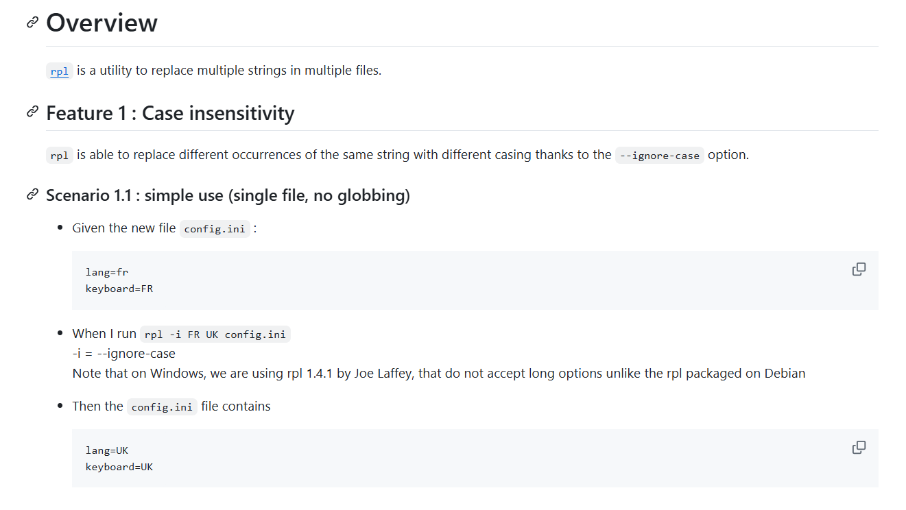

[](https://alire.ada.dev/crates/bbt.html) [](https://opensource.org/licenses/Apache-2.0)

[![image|61x20](https://img.shields.io/badge/Crate_of_the_Year-2024-black?style=flat-square&logoColor=white&logo=data:image/svg%2bxml;base64,PD94bWwgdmVyc2lvbj0iMS4wIiBlbmNvZGluZz0iVVRGLTgiPz4KPHN2ZyBpZD0ic3ZnX3Jvb3QiIHdpZHRoPSIzMDAiIGhlaWdodD0iMTUwIiB2ZXJzaW9uPSIxLjEiIHZpZXdCb3g9IjAgMCAzMDAgMTUwIiB4bWxucz0iaHR0cDovL3d3dy53My5vcmcvMjAwMC9zdmciPgogPGcgdHJhbnNmb3JtPSJ0cmFuc2xhdGUoOCAtMzEuMTk3KSI+CiAgPGcgdHJhbnNmb3JtPSJtYXRyaXgoMS4zMzMzIDAgMCAtMS4zMzMzIDAgMjAwKSI+CiAgIDxnIHRyYW5zZm9ybT0ic2NhbGUoLjA5NSkiPgogICAgPHBhdGggaWQ9InN2Z19sb2dvIiBkPSJtMTczNS45IDYwOC41YzAgMzguODk2IDQwLjk0MSA1My4yMTcgMTA3LjQ5IDYwLjM4NyA1NS4yNjUgNi4xMzkxIDk5LjI4NSAxNS4zNTUgMTI3Ljk1IDMzLjc3OXYtNDkuMTMxYzAtNTguNjQtNDkuMzcxLTg3LjE2NS0xMTUuMjgtOTMuNjc4LTI2Ljg4OSAyLjQ5OTMtNTUuMDI1IDQuODQyNy04NC4yNDEgNi45ODIxLTIyLjczIDguNjY5Ny0zNS45MTggMjMuNC0zNS45MTggNDEuNjYxem0tMTI3NC41LTE3LjQwMmgyODMuNTZsMjMuMjY2LTY4LjgwOWMtMTIyLjA1LTIyLjIxMi0yNDMuNTQtNTEuNDctMzYwLjc2LTg4LjM1MXptMTQxLjI3IDQxNy42NCA5OS4yODYtMjkxLjc0aC0xOTguNTl6bTYzMC41Ni0xNDYuMzhjNzQuNzMyIDAgMTM1LjEyLTY3LjU2NyAxMzUuMTItMTUxLjUgMC01OS4zNTYtMzEuNzkxLTExMC40OC03Ny42OTktMTM0LjIzLTM0LjU3NS0xLjE1NjUtNjkuNTk3LTIuNzQ5Ny0xMDQuOTYtNC44MTE1LTUxLjE3OCAyMC42ODItODcuNTc2IDczLjkzMy04Ny41NzYgMTM5LjA0IDAgODUuOTgyIDYwLjM5MiAxNTEuNSAxMzUuMTIgMTUxLjV6bTg2NC4xLTMzMy4yNGMtMC4wNzIgMS45MzcxLTAuMTQzOSAzLjg1OS0wLjE0MzkgNS42NzA1djI3NC4zNWMwIDQxLjk2My0xNi4zNzIgMTgwLjE2LTIzMC4zMSAxODAuMTYtMTM4LjE5IDAtMjM0LjQyLTc0LjcyNy0yNDcuNzMtMTc1LjA0aDEzNS4xM2MxMi4yODUgNDUuMDQ1IDY3LjU2NiA2Ni41MzkgMTE1LjY4IDY2LjUzOSA2MC4zODQgMCA5Ni4yMDYtMjIuNTI1IDk2LjIwNi01MC4xNTkgMC00Mi45ODgtNjIuNDM5LTUzLjIzNi0xNTAuNDctNjEuNDIxLTExNi42OS0xMC4yMzItMjE1Ljk5LTQwLjk0My0yMTUuOTktMTU5LjY5IDAtMTEuNzk0IDEuMTgzNy0yMi45IDMuMjU1Mi0zMy40Ni0zMi4zNTEgMS4xNzE3LTY1LjU1IDIuMDMwNy05OS40ODUgMi41MzA1djYzMS44MWgtMTM1LjEydi0yODQuNThjLTQwLjk0MSAzOC45MDItOTQuMTgzIDYxLjQyMy0xNTUuNiA2MS40MjMtMTM3LjE3IDAtMjUwLjgtMTE4Ljc0LTI1MC44LTI3NS4zNyAwLTU4LjM0IDE2LjAyOC0xMTEuNDggNDMuMjQ0LTE1NS4xNC0zMy44ODctMy43MTgyLTY3LjkxOC03Ljk2NjctMTAyLjAyLTEyLjc0N2wtMjE0LjU0IDYxNS4yMmgtMTcwLjk1bC0yNzIuNjMtNzgyLjQ5Yy03OS42MjUtMzEuMzA0LTE1Ni4yMS02Ni41NzYtMjI4LjQtMTA2LjAxIDM0OS40OCAxNTIuNDggMTIxMS4zIDM1OC44OSAyMTg2LjcgMjMyLjQ0LTQuNjU0NiA1LjE2OTgtNDIuNDc2IDE1LjAyNy0xMDYuMDMgMjUuOTYxIi8+CiAgIDwvZz4KICA8L2c+CiA8L2c+Cjwvc3ZnPgo=)](https://blog.adacore.com/ada-spark-crate-of-the-year-2024-winners-announced) [](https://blog.adacore.com/ada-spark-crate-of-the-year-2024-winners-announced)

1. xxx

[![image|61x20](https://img.shields.io/badge/inside-slategrey?style=flat-square&logoColor=blue&logo=data:image/svg%2bxml;base64,PD94bWwgdmVyc2lvbj0iMS4wIiBlbmNvZGluZz0iVVRGLTgiPz4KPHN2ZyBpZD0ic3ZnX3Jvb3QiIHdpZHRoPSIzMDAiIGhlaWdodD0iMTUwIiB2ZXJzaW9uPSIxLjEiIHZpZXdCb3g9IjAgMCAzMDAgMTUwIiB4bWxucz0iaHR0cDovL3d3dy53My5vcmcvMjAwMC9zdmciPgogPGcgdHJhbnNmb3JtPSJ0cmFuc2xhdGUoOCAtMzEuMTk3KSI+CiAgPGcgdHJhbnNmb3JtPSJtYXRyaXgoMS4zMzMzIDAgMCAtMS4zMzMzIDAgMjAwKSI+CiAgIDxnIHRyYW5zZm9ybT0ic2NhbGUoLjA5NSkiPgogICAgPHBhdGggaWQ9InN2Z19sb2dvIiBkPSJtMTczNS45IDYwOC41YzAgMzguODk2IDQwLjk0MSA1My4yMTcgMTA3LjQ5IDYwLjM4NyA1NS4yNjUgNi4xMzkxIDk5LjI4NSAxNS4zNTUgMTI3LjkwIDMzLjc3OXYtNDkuMTMxYzAtNTguNjQtNDkuMzcxLTg3LjE2NS0xMTUuMjgtOTMuNjc4LTI2Ljg4OSAyLjQ5OTMtNTUuMDI1IDQuODQyNy04NC4yNDEgNi45ODIxLTIyLjczIDguNjY5Ny0zNS45MTggMjMuNC0zNS45MTggNDEuNjYxem0tMTI3NC41LTE3LjQwMmgyODMuNTZsMjMuMjY2LTY4LjgwOWMtMTIyLjA1LTIyLjIxMi0yNDMuNTQtNTEuNDctMzYwLjc2LTg4LjM1MXptMTQxLjI3IDQxNy42NCA5OS4yODYtMjkxLjc0aC0xOTguNTl6bTYzMC41Ni0xNDYuMzhjNzQuNzMyIDAgMTM1LjEyLTY3LjU2NyAxMzUuMTItMTUxLjUgMC01OS4zNTYtMzEuNzkxLTExMC40OC03Ny42OTktMTM0LjIzLTM0LjU3NS0xLjE1NjUtNjkuNTk3LTIuNzQ5Ny0xMDQuOTYtNC44MTE1LTUxLjE3OCAyMC42ODItODcuNTc2IDczLjkzMy04Ny41NzYgMTM5LjA0IDAgODUuOTgyIDYwLjM5MiAxNTEuNSAxMzUuMTIgMTUxLjV6bTg2NC4xLTMzMy4yNGMtMC4wNzIgMS45MzcxLTAuMTQzOSAzLjg1OS0wLjE0MzkgNS42NzA1djI3NC4zNWMwIDQxLjk2My0xNi4zNzIgMTgwLjE2LTIzMC4zMSAxODAuMTYtMTM4LjE5IDAtMjM0LjQyLTc0LjcyNy0yNDcuNzMtMTc1LjA0aDEzNS4xM2MxMi4yODUgNDUuMDQ1IDY3LjU2NiA2Ni41MzkgMTE1LjY4IDY2LjUzOSA2MC4zODQgMCA5Ni4yMDYtMjIuNTI1IDk2LjIwNi01MC4xNTkgMC00Mi45ODgtNjIuNDM5LTUzLjIzNi0xNTAuNDctNjEuNDIxLTExNi42OS0xMC4yMzItMjE1Ljk5LTQwLjk0My0yMTUuOTktMTU5LjY5IDAtMTEuNzk0IDEuMTgzNy0yMi45IDMuMjU1Mi0zMy40Ni0zMi4zNTEgMS4xNzE3LTY1LjU1IDIuMDMwNy05OS40ODUgMi41MzA1djYzMS44MWgtMTM1LjEydi0yODQuNThjLTQwLjk0MSAzOC45MDItOTQuMTgzIDYxLjQyMy0xNTUuNiA2MS40MjMtMTM3LjE3IDAtMjUwLjgtMTE4Ljc0LTI1MC44LTI3NS4zNyAwLTU4LjM0IDE2LjAyOC0xMTEuNDggNDMuMjQ0LTE1NS4xNC0zMy44ODctMy43MTgyLTY3LjkxOC03Ljk2NjctMTAyLjAyLTEyLjc0N3wtMjE0LjU0IDYxNS4yMmgtMTcwLjk1bC0yNzIuNjMtNzgyLjQ5Yy03OS42MjUtMzEuMzA0LTE1Ni4yMS02Ni41NzYtMjI4LjQtMTA2LjAxIDM0OS40OCAxNTIuNDggMTIxMS4zIDM1OC44OSAyMTg2LjcgMjMyLjQ0LTQuNjU0NiA1LjE2OTgtNDIuNDc2IDE1LjAyNy0xMDYuMDMgMjUuOTYxIi8+CiAgIDwvZz4KICA8L2c+CiA8L2c+Cjwvc3ZnPgo=)](https://ada-lang.io/)

2. yyy

[![image|61x20](https://img.shields.io/badge/inside-darkslateblue?style=flat-square&logoColor=white&logo=data:image/svg%2bxml;base64,PD94bWwgdmVyc2lvbj0iMS4wIiBlbmNvZGluZz0iVVRGLTgiPz4KPHN2ZyBpZD0ic3ZnX3Jvb3QiIHdpZHRoPSIzMDAiIGhlaWdodD0iMTUwIiB2ZXJzaW9uPSIxLjEiIHZpZXdCb3g9IjAgMCAzMDAgMTUwIiB4bWxucz0iaHR0cDovL3d3dy53My5vcmcvMjAwMC9zdmciPgogPGcgdHJhbnNmb3JtPSJ0cmFuc2xhdGUoOCAtMzEuMTk3KSI+CiAgPGcgdHJhbnNmb3JtPSJtYXRyaXgoMS4zMzMzIDAgMCAtMS4zMzMzIDAgMjAwKSI+CiAgIDxnIHRyYW5zZm9ybT0ic2NhbGUoLjA5NSkiPgogICAgPHBhdGggaWQ9InN2Z19sb2dvIiBkPSJtMTczNS45IDYwOC41YzAgMzguODk2IDQwLjk0MSA1My4yMTcgMTA3LjQ5IDYwLjM4NyA1NS4yNjUgNi4xMzkxIDk5LjI4NSAxNS4zNTUgMTI3Ljk1IDMzLjc3OXYtNDkuMTMxYzAtNTguNjQtNDkuMzcxLTg3LjE2NS0xMTUuMjgtOTMuNjc4LTI2Ljg4OSAyLjQ5OTMtNTUuMDI1IDQuODQyNy04NC4yNDEgNi45ODIxLTIyLjczIDguNjY5Ny0zNS45MTggMjMuNC0zNS45MTggNDEuNjYxem0tMTI3NC41LTE3LjQwMmgyODMuNTZsMjMuMjY2LTY4LjgwOWMtMTIyLjA1LTIyLjIxMi0yNDMuNTQtNTEuNDctMzYwLjc2LTg4LjM1MXptMTQxLjI3IDQxNy42NCA5OS4yODYtMjkxLjc0aC0xOTguNTl6bTYzMC41Ni0xNDYuMzhjNzQuNzMyIDAgMTM1LjEyLTY3LjU2NyAxMzUuMTItMTUxLjUgMC01OS4zNTYtMzEuNzkxLTExMC40OC03Ny42OTktMTM0LjIzLTM0LjU3NS0xLjE1NjUtNjkuNTk3LTIuNzQ5Ny0xMDQuOTYtNC44MTE1LTUxLjE3OCAyMC42ODItODcuNTc2IDczLjkzMy04Ny41NzYgMTM5LjA0IDAgODUuOTgyIDYwLjM5MiAxNTEuNSAxMzUuMTIgMTUxLjV6bTg2NC4xLTMzMy4yNGMtMC4wNzIgMS45MzcxLTAuMTQzOSAzLjg1OS0wLjE0MzkgNS42NzA1djI3NC4zNWMwIDQxLjk2My0xNi4zNzIgMTgwLjE2LTIzMC4zMSAxODAuMTYtMTM4LjE5IDAtMjM0LjQyLTc0LjcyNy0yNDcuNzMtMTc1LjA0aDEzNS4xM2MxMi4yODUgNDUuMDQ1IDY3LjU2NiA2Ni41MzkgMTE1LjY4IDY2LjUzOSA2MC4zODQgMCA5Ni4yMDYtMjIuNTI1IDk2LjIwNi01MC4xNTkgMC00Mi45ODgtNjIuNDM5LTUzLjIzNi0xNTAuNDctNjEuNDIxLTExNi42OS0xMC4yMzItMjE1Ljk5LTQwLjk0My0yMTUuOTktMTU5LjY5IDAtMTEuNzk0IDEuMTgzNy0yMi45IDMuMjU1Mi0zMy40Ni0zMi4zNTEgMS4xNzE3LTY1LjU1IDIuMDMwNy05OS40ODUgMi41MzA1djYzMS44MWgtMTM1LjEydi0yODQuNThjLTQwLjk0MSAzOC45MDItOTQuMTgzIDYxLjQyMy0xNTUuNiA2MS40MjMtMTM3LjE3IDAtMjUwLjgtMTE4Ljc0LTI1MC44LTI3NS4zNyAwLTU4LjM0IDE2LjAyOC0xMTEuNDggNDMuMjQ0LTE1NS4xNC0zMy44ODctMy43MTgyLTY3LjkxOC03Ljk2NjctMTAyLjAyLTEyLjc0N2wtMjE0LjU0IDYxNS4yMmgtMTcwLjk1bC0yNzIuNjMtNzgyLjQ5Yy03OS42MjUtMzEuMzA0LTE1Ni4yMS02Ni41NzYtMjI4LjQtMTA2LjAxIDM0OS40OCAxNTIuNDggMTIxMS4zIDM1OC44OSAyMTg2LjcgMjMyLjQ0LTQuNjU0NiA1LjE2OTgtNDIuNDc2IDE1LjAyNy0xMDYuMDMgMjUuOTYxIi8+CiAgIDwvZz4KICA8L2c+CiA8L2c+Cjwvc3ZnPgo=)](https://ada-lang.io/) 

3. www
   
![](https://img.shields.io/badge/play-station-blue.svg?style=flat-square&logo=data:image/svg+xml;base64,PHN2ZyB4bWxucz0iaHR0cDovL3d3dy53My5vcmcvMjAwMC9zdmciIHdpZHRoPSIzMDAiIGhlaWdodD0iMjAwIj48cmVjdCBpZD0iYmFja2dyb3VuZHJlY3QiIHdpZHRoPSIxMDAlIiBoZWlnaHQ9IjEwMCUiIHg9IjAiIHk9IjAiIGZpbGw9Im5vbmUiIHN0cm9rZT0ibm9uZSIgc3R5bGU9IiIgY2xhc3M9IiIvPgogICAgICAKICAgICAgPCEtLSA8Y2lyY2xlIGlkPSJzdmdfY2lyY2xlX2ZyYW1lIiBjeD0iMTUwIiBjeT0iMTUwIiByPSIxNDgiIHN0eWxlPSJmaWxsOm5vbmU7c3Ryb2tlLXdpZHRoOjUiIHN0cm9rZT0iYmxhY2siLz4gLS0+CiAgICAgIAogICAgICAKICAgIDxnIGNsYXNzPSJjdXJyZW50TGF5ZXIiIHN0eWxlPSIiPjx0aXRsZT5MYXllciAxPC90aXRsZT48cmVjdCBpZD0ic3ZnX2ZyYW1lIiB3aWR0aD0iMzAwIiBoZWlnaHQ9IjE5My43ODUzMTU0NzA2MzYwMiIgc3R5bGU9ImZpbGw6bm9uZTtzdHJva2Utd2lkdGg6MTAiIHN0cm9rZT0ibm9uZSIgY2xhc3M9IiIgeT0iLTQuMDQ5ODQ5NzM1NTY1NjU4ZS03IiB4PSIwIi8+PGcgaWQ9InN2Z18xIiBjbGFzcz0iIj4KICAgICAgICA8ZyBpZD0iZzEwIj4KICAgICAgICAgIDxnIHN0cm9rZS13aWR0aD0iMCIgaWQ9InN2Z18yIj4KICAgICAgICAgICAgPHBhdGggaWQ9InN2Z19sb2dvIiBmaWxsPSIjZmZmZmZmIiBzdHlsZT0iZmlsbC1vcGFjaXR5OjE7ZmlsbC1ydWxlOm5vbnplcm87c3Ryb2tlOm5vbmU7c3Ryb2tlLXdpZHRoOjAuNzk5Nzg0NzIiIGQ9Im0yMjUuNjI1ODM3ODk2OTMxMDIsMTE5Ljk4NTg3NTk4NzE0Njc2IGMwLC00LjkyNjgxNzYxNTAwNjE0MSA1LjE4NTg1OTgwNTI3OTUzNSwtNi43NDA4MDMyODAyMjczMSAxMy42MTU1MjYxNTU0MjYxNjIsLTcuNjQ5MDEzMzc5NDU4ODU1NSBjNy4wMDAyNTg0MDM4MTg1MzMsLTAuNzc3NjI0MzcwODAxNDkgMTIuNTc2MTM3NTI3Nzg2ODIxLC0xLjk0NDk3NTQ2MDMwMjcxOTQgMTYuMjA2OTQ4NzI0Nzg5MTkzLC00LjI3ODY2MDUwNjAxMDAzNiB2Ni4yMjMyMzA2MzI5OTQ2NDEgYzAsNy40Mjc3NjA5MjEwOTk4NTI1IC02LjI1MzYwOTA5ODUyMDY0OCwxMS4wNDA4NDI1ODU0MzQ2MDkgLTE0LjYwMjI0Njc4NTA0MzEsMTEuODY1ODc4Mjg3Nzg5MjEzIGMtMy40MDU5MTQ1Mzg3ODAyMDQ2LC0wLjMxNjU4MTc4ODExMjg3NzM1IC02Ljk2OTg3MTA3MTYyNjE5MywtMC42MTM0MDczNzY5Njc1NjY4IC0xMC42NzA1NzY5MzI2NzA4MDUsLTAuODg0NDAzMTAwMTI1NDU4NSBjLTIuODc5MTIwNTU4NTYwNDQ4LC0xLjA5ODE1Njg5MjA5OTM1NyAtNC41NDk2NTExNjI1MDE0NTEsLTIuOTY0MDExMjg4NzA2Mjc0NiAtNC41NDk2NTExNjI1MDE0NTEsLTUuMjc3MDMxOTM1MTg5NTA1IHpNNjQuMTk1MTM1NjkxNzIwNCwxMjIuMTkwMDkzNzcxMDQ4NjggaDM1LjkxNzM1NTQ1MTM2MjY3IGwyLjk0Njk5MzYyMjY3ODU5Myw4LjcxNTg2NzEzOTQwMDI2IEM4Ny42MDAzODIzNDYyMjU0LDEzMy43MTk1MzQwMDQ4MDM5MyA3Mi4yMTA1NzI5MjQwODczLDEzNy40MjU1MTI5OTg5ODM5IDU3LjM2MzY2MzE0ODIzMDksMTQyLjA5NzAzOTAyMzU3NTggek04Mi4wODk4Mzc4ODY0NzA1OCw2OS4yODg4NzA3NTc0MDIxOCBMOTQuNjY2MDc0MjE0MjUzNjgsMTA2LjI0MjY5NTE2OTg0NzE0IEg2OS41MTE2Nzc0OTIwOTMwNCB6TTE2MS45NjEwNDU2MjA3NzIwNyw4Ny44MzA2MjI5OTQ1MjMzNyBjOS40NjYwNTI5Nzc4OTg2ODgsMCAxNy4xMTU2NjgwMjQwMDE2Miw4LjU1ODQzNjk0NTMxMTUwMiAxNy4xMTU2NjgwMjQwMDE2MiwxOS4xODk1OTY0Nzk0NjIzNjcgYzAsNy41MTg0Mjg5MTc2OTU0MTkgLTQuMDI2OTEwNTE1NDYyODMxNSwxMy45OTQ1MjE2NzQ1Mjg4MzkgLTkuODQxODg1NjMwNDUzNDYsMTcuMDAxOTkzNTYxNjAzMjQgYy00LjM3OTQ0OTE2ODg5MjI1NCwwLjE0NjQ4ODcyNzgzMjkyMzgzIC04LjgxNTY0NTAwMjMyMDQzNCwwLjM0ODI5MTUyMDI1NTU2MjM3IC0xMy4yOTU0MDE1MDA3Nzk2NDcsMC42MDk0NTc5MTA0NDkxOTY1IGMtNi40ODI1ODQ0MjMyNTYzMzUsLTIuNjE5Njc0MzAxNjM1NTYgLTExLjA5MzAxMDI1MDE0MjQ2NiwtOS4zNjQ4MzQ5MTUwMzI1OTQgLTExLjA5MzAxMDI1MDE0MjQ2NiwtMTcuNjExNDUxNDcyMDUyNDM3IGMwLC0xMC44OTExMTExOTEwNTY3NzQgNy42NDk2MTUwNDYxMDI5MywtMTkuMTg5NTk2NDc5NDYyMzY3IDE3LjExNDYyOTM1NzM3Mzk1MywtMTkuMTg5NTk2NDc5NDYyMzY3IHptMTA5LjQ1MzEwNTg5MDIxNjc4LDQyLjIxMDY4OTc0ODM5MTY5NCBjLTAuMDA5MTE5OTk5NjU3NTU5MDg1LC0wLjI0NTM2MzQ1NzQ1MzY3NDM4IC0wLjAxODIyNzMzMjY0ODkyNzEzMywtMC40ODg4MDE1ODE2NDYzMDg1NSAtMC4wMTgyMjczMzI2NDg5MjcxMzMsLTAuNzE4MjU5NTA2MzYzODc2NCB2LTM0Ljc1MDQxMDk2MTg0NjE3IGMwLC01LjMxNTMyNzA2NzA4NDkyIC0yLjA3Mzc0ODU4ODgwMDgzNDUsLTIyLjgyMDAwMjM0MzE0NjYyMyAtMjkuMTczMTE4MjM3OTMwOTU3LC0yMi44MjAwMDIzNDMxNDY2MjMgYy0xNy41MDQ2NzQwMDkzOTUwODUsMCAtMjkuNjkzODA2ODg1MDQ2NjI3LDkuNDY1NDMyMzExMjU1MzI3IC0zMS4zNzk1NTAxNTUwODMwODgsMjIuMTcyMjUxODM0MTM1MjUzIGgxNy4xMTY2Njg2OTA2MzA3MSBjMS41NTYwNzQ2MDgyMzg2MzcsLTUuNzA1NjU5MjUyNDI4NTkyNSA4LjU1ODM0NzAxMTk4MTU0OCwtOC40MjgyNjAzNTAxOTk0MiAxNC42NTI5MTM0NDk4MDczMTUsLTguNDI4MjYwMzUwMTk5NDIgYzcuNjQ4NjE0Mzc5NDczODM3NSwwIDEyLjE4NjEwNTU0MjQzMTg3NywyLjg1MzE4MzAyNjIwMTAyNjMgMTIuMTg2MTA1NTQyNDMxODc3LDYuMzUzNDExMDI4MTA2NTgyIGMwLDUuNDQ1MjAwOTI4ODc1MDM4IC03LjkwODk2NTAzNjM2NDc2Nyw2Ljc0MzIzNTI4MDEzNTk5MyAtMTkuMDU5NzIyNjE3NjcyMjQ3LDcuNzgwMDAxOTA3ODczNzg2IGMtMTQuNzgwNTU1NDQ1MDE0NTY5LDEuMjk2MDA2NDE4MDAzNzY3NCAtMjcuMzU4NzE5NjM5MzkxOTYsNS4xODYwNTg2NzE5Mzg3MzUgLTI3LjM1ODcxOTYzOTM5MTk2LDIwLjIyNzE3MjUwNzE2OTc3IGMwLDEuNDkzODU5NzQzOTA4MDM1NCAwLjE0OTkzNTMyNzcwMzUwOTU2LDIuOTAwNjk2OTU3NzUwMjg5NyAwLjQxMjMyNTMxNzg1MTE5OTIsNC4yMzgyNDExNzQxOTQzODIgYy00LjA5NzgzMTE3OTQ2NjU0NSwtMC4xNDg0MTQwNjEwOTM5NjQgLTguMzAzMDUwMzU0OTAwODQ3LC0wLjI1NzIxNjkyMzY3NTI2MzA1IC0xMi42MDE0NTgxOTM1MDI3MzgsLTAuMzIwNTMyNTIxMjk3ODY3MTMgVjQzLjc0NTU2MzA0OTg0NDUyIEgxNzkuMDc2NzEzNjQ0NzczNyBWNzkuNzkyMjkwNzYzMDE2MTMgYy01LjE4NTg1OTgwNTI3OTUzNSwtNC45Mjc1MjgyMTQ5Nzk0NTkgLTExLjkyOTc5NTU1MjA1NTg5MywtNy43ODAzMDU5MDc4NjIzNzEgLTE5LjcwOTA5MTkyNjYyMjgzNiwtNy43ODAzMDU5MDc4NjIzNzEgYy0xNy4zNzUwMDUzNDc1OTcyNjMsMCAtMzEuNzY3NTUwNDA3MTgwOTg0LDE1LjAzOTg5NzgzNTI3NjY5MiAtMzEuNzY3NTUwNDA3MTgwOTg0LDM0Ljg3OTY3NjgyMzY1OTExIGMwLDcuMzg5NzcxMDU1ODU5NjQzIDIuMDMwMTc1MjU3MTAzNjA3NiwxNC4xMjEwNTI4MDMxMTExMzcgNS40Nzc2MDYwNjA5OTE2MTE1LDE5LjY1MTM1MDkyODc5MDkxNSBjLTQuMjkyMzIyNzcyMTYzNzA4NSwwLjQ3MDk3MTk4MjMxNTc4MDUgLTguNjAyOTAzMjc2OTc1MiwxLjAwOTExMDIyODc3NjI0NTIgLTEyLjkyMjU5MTExNDc3ODA2LDEuNjE0NjE2MTM5MzczODMyNyBMOTIuOTgwMjQxMDEwODg3MjcsNTAuMjI5MTYwODA2Mzk2MTUgSDcxLjMyNjg4MDQyMzkzNTE4IEwzNi43OTM3Njk5MjA1OTY0MDQsMTQ5LjM0NDc3ODc1MTQzNTE0IEMyNi43MDc5NDA3NjU5NjkyODcsMTUzLjMwOTk5ODgwMjU0NzY4IDE3LjAwNjY1ODI5NjkwMzA3NiwxNTcuNzc3Nzk5MjM0Nzg5MTcgNy44NjMzOTA4NjAyMTc2NTYsMTYyLjc3MjE4ODQ0NzI1ODEyIEM1Mi4xMzA1OTU5NDQ3MjM5MywxNDMuNDU4Mzg4OTcyNDU5MzUgMTYxLjI5MTQyMjMxMjU4MiwxMTcuMzEyNzEyODg3NTE5NjQgMjg0Ljg0NDI4ODM0MDA0Mjc0LDEzMy4zMjk3MDg0ODYxMDc5IGMtMC41ODk1ODI2NDQ1Mjg4MTI4LC0wLjY1NDg0MjU3NTQxMTc0MzYgLTUuMzgwMzU2NDY0NjQzMTc0NSwtMS45MDM0NDAxOTUxOTU2MzI4IC0xMy40MzAxMzY4MjkwNTM4OTEsLTMuMjg4Mzk1NzQzMTkyODQxNCAiIHN0cm9rZS13aWR0aD0iMCIvPgogICAgICAgICAgPC9nPgogICAgICAgIDwvZz4KICAgICAgPC9nPjwvZz48L3N2Zz4=)

4. qqq
 
  

# `bbt` README <!-- omit from toc -->

- [Overview](#overview)
  - [What does the behavior description look like?](#what-does-the-behavior-description-look-like)
  - [Partial parsing](#partial-parsing)
  - [Step arguments](#step-arguments)
  - [One more example](#one-more-example)
- [Installation](#installation)
  - [Stable version](#stable-version)
  - [Latest version](#latest-version)
- [First use](#first-use)
- [Why should I use bbt?](#why-should-i-use-bbt)
  - [Write once](#write-once)
  - [Write a real documentation, not just a ".feature" Gherkin file](#write-a-real-documentation-not-just-a-feature-gherkin-file)
  - [Be proficient in no time](#be-proficient-in-no-time)
  - [No-fuss no-wait run](#no-fuss-no-wait-run)
  - [Ready to publish output](#ready-to-publish-output)
- [Status of the project](#status-of-the-project)
- [Help and comments](#help-and-comments)
- [Further reading](#further-reading)

## Overview

bbt is a simple tool to black box check the behavior of an executable through [Command Line Interface (CLI)](https://en.wikipedia.org/wiki/Command-line_interface).  
Hence the name: bbt stands for *Black Box Tester*.  

bbt targets both *specification of the behavior* and *end-to-end test automation* for the very common case of apps taking some input and producing some output.  
It enable developers **to write and execute comprehensive test scenarios in just a few minutes**. 

The outstanding feature of btt is that **it directly uses your behavior documentation in plain english**.  
There is no script nor other file to write.

### What does the behavior description look like?

The behavior is described in almost natural English, in Markdown, using the [BDD](https://en.wikipedia.org/wiki/Behavior-driven_development) / [Gherkin](https://en.wikipedia.org/wiki/Cucumber_(software)#Gherkin_language) usual pattern *Given / When / Then*.  
Here is a minimal example:  

```md
### Scenario: I want to know gcc version

- When I run `gcc --version`
- Then the output contains `14.2.0`
```  
resulting in:

### Scenario: I want to know gcc version  <!-- omit from toc -->

- When I run `gcc --version`
- Then the output contains `14.2.0`

bbt being about documentation and simplicity, Markdown[^1] is a perfect fit.  

Let's consider a slightly more complete example:


(Markdown source [here](docs/examples/rpl_case_insensitivity.md))

We have:

1. An "Overview" header and a first text   
   All this is ignored, because: 
   - bbt processes **only** Gherkin headers *# Features*, *# Background*, and *# Scenario* or *# Example*.   
   - bbt considers all text lines as comment, except Step lines.  
   
   bbt staying out of the way, you're free to use markdown almost without constraints to draft nice documentations. 
   
1. A "Feature" and a "Scenario" header (followed by the feature/scenario name)  
   bbt is now awake, and waiting for step lines.  
   Note that header's level is ignored (*#### Scenario*, is equal to *# Scenario* for bbt), you're free to structure the file as you want. 

2. Steps  
   Steps are lines starting with *- Given*, *- When*, *- Then*, *- And*, *- But*, that contain the things to check or do.

### Partial parsing 

A distinctive feature of bbt is that it seems to directly understand those almost normal English sentences like:  
```
- When I run `sut --quiet input.txt`
- Then there is no output
```
This is achieved thanks to a [partial parser](https://devopedia.org/natural-language-parsing). It means that there is no rigid grammar, because bbt takes into account only some keywords to recognize the skeleton of the sentence.  

So when you write:  
> - Then I should get `version 15.0.0` (Fix #2398 and #2402)    

bbt actually reads:  
> - then get `version 15.0.0`     
  
And this is what gives the ability to write steps in almost natural language. 

### Step arguments

Step's argument may be strings or multiline text.

As per [MDG](https://github.com/cucumber/gherkin/blob/main/MARKDOWN_WITH_GHERKIN.md#markdown-with-gherkin), bbt uses :
- multiline text (expected output, file content, etc) : [fenced code blocks](https://spec.commonmark.org/0.31.2/#fenced-code-blocks), that is a text between two "```" lines
- strings (file name, command to run, etc.) : [code span](https://spec.commonmark.org/0.31.2/#code-spans), that is a string between backticks  

It's not only to nicely highlight inputs in the doc, but also because otherwise the analysis of the steps would be too complex.  
 
### One more example

[This example](docs/examples/gcc_hello_word.md) shows how simple it is to run a `gcc` sanity test, that compiles and runs the ubiquitous *Hello Word*.

## Installation

### Stable version

[](https://alire.ada.dev/crates/bbt.html) is available on Windows, Linux and Darwin thanks to the Alire package manager:

1. Go to [Alire home](https://alire.ada.dev/) for a “one click” install.  
   
2. Run :
   > alr install bbt

   The exe will be moved in ~/.alire/bin on Linux and Darwin, or in xxxx on Windows.  
   Alternatively, you may choose another installation directory with:
   > alr install --prefix=/path/to/installation bbt  

   If needed, ensure that the installation directory is in your PATH.

### Latest version

For Linux user, an AppImage of the latest version is available [here](https://github.com/LionelDraghi/bbt/releases).  
(Thanks to @mgrojo and [Alr2AppImage](https://github.com/mgrojo/alr2appimage)).  
Download the AppImage, and:  
```sh
chmod +x bbt-0.1.0-x86_64.AppImage
ln -s bbt-0.1.0-x86_64.AppImage bbt
```

Or, to build the latest version on Windows, Darwin or Linux:
```sh
git clone https://github.com/LionelDraghi/bbt  
cd bbt  
alr build 
```

## First use

The easiest way to start is illustrated by Simon in it's [ada_caser](https://github.com/simonjwright/ada_caser/tree/main) project.  
He just created a scenario file called `tests.md`, and put in the README a reference to that file and the command line to run the tests.  
Thats'it, he didn't even need to create a "tests" directory.

## Why should I use bbt?

### Write once

Specification is the only source of truth. This is bbt most interesting feature, there is nothing else: no intermediate representation, no glue code, no scripting language, no duplication of the original source at all.  

With two main consequences: 
1. writing a test is a matter of minutes,
2. there is no more place for a discrepancy between documentation and tests.

Alternative tools exist, some are mentioned in [my quick overview of some comparable tools](docs/comparables.md).  
But as far as I know, **bbt is the only one to provide such a direct "run the doc" approach**.

### Write a real documentation, not just a ".feature" Gherkin file  

bbt effectiveness does not come at the cost of limiting documentation readability or expressiveness: 

- First, the vast majority of the file is just plain markdown : use it, structure it the way you like, give as much context as you want, and use all Markdown cool extensions (for example graphics with [Mermaid](https://mermaid.js.org/intro/));
- Second, even the part that is interpreted by bbt, the steps, is written in readable English thanks to the partial parsing.

Nice consequence, bbt scenarios may be written by non coders people.

### Be proficient in no time

bbt Steps uses a limited English subset, with a vocabulary dedicated to test with no-surprise keywords like *run*, *output*, *contains*, etc.  

Although simple, you don't have to learn this subset by heart, you may :
- ask for a template scenario by running `bbt create_template` (short form `bbt ct`), or
- ask for the complete grammar with `bbt list_grammar` (short form `bbt lg`).  

### No-fuss no-wait run

To run a scenario : `bbt my_scenario.md`  
To run all the md files in the *tests* tree `bbt -r tests`  
To run only a selection `bbt --select "Sanity check" tests`  

bbt has no dependencies on external lib or tools (diff, for example) and can be run as is on major native platforms.  

### Ready to publish output 

bbt output is in Markdown format. You can adjust the detail level with the usual "-q" and "-v" options.

The output cross-references the executed scenario files: if a test fails, just click on the link and you are in the scenario.  
You can push it on GitHub without further processing.  

To see what it looks like, consider [bbt own tests](docs/tests_results/Linux/features_results.md).  

Test results are generated when running `bbt`, by just using the `-o` option (`--output`).
  
## Status of the project

bbt is in an early stage, meaning that interface and behavior are subject to changes.  
Feel free to make features suggestions [in bbt discussions](https://github.com/LionelDraghi/bbt/discussions). 

The code has grown fast in 2024, and is far from being clean.  
Nevertheless, bbt is working, and has as a serious [test base](docs/tests_results/Linux/features_results.md).  

A very conclusive test on the effectiveness of bbt as being conducted on [the day 4 of Advent of Code 2024's challenges](https://github.com/LionelDraghi/Advent_of_code_2024/blob/main/day_04_tests.md).   
Tests where easy and fast to setup, allowing to stay most of the time focus on coding.

In real life, the [acc](https://github.com/LionelDraghi/ArchiCheck) project has largely migrated to BBT, resulting in a drastically reduced number of files and a significant gain in maintenability and readability of the tests.  
Other people are using it too.  

btt compile on Linux, Windows and Mac OS, and the test suite is run on the three platforms.  
On MacOS, it may be useful to set the environment variable GNAT_FILE_NAME_CASE_SENSITIVE to 1, cf. discussion [here](https://forum.ada-lang.io/t/name-file-casing-error-on-darwin/1795) to avoid small glitches on file names.  

## Help and comments
Comments are welcome [here](https://github.com/LionelDraghi/bbt/discussions)

## Further reading
- [User Guide](docs/UG.md): concepts, command, features...
- [Developer Guide](docs/developer_guide.md): design overview, issues, fixme...
- [References](docs/references.md): syntax, grammar, and more details on non obvious behavior
- [Project status](docs/project.md): changelog, tests, TDL...
- [Command line help](docs/bbt_help.md)

[^1]: More precisely, this is a subset of the existing [Markdown with Gherkin (MDG)](https://github.com/cucumber/gherkin/blob/main/MARKDOWN_WITH_GHERKIN.md#markdown-with-gherkin) format.  

