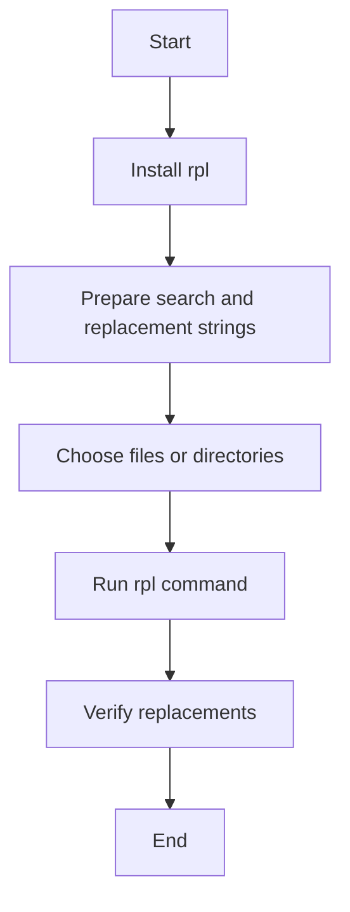

# RPL Utility User Guide

The `rpl` utility is a powerful command-line tool designed for replacing strings in files. It is particularly useful for batch processing and automating text replacements across multiple files. This guide will walk you through the basic usage of `rpl`, provide examples, and include a flowchart to illustrate the process.

## Table of Contents

1. [Installation](#installation)
2. [Basic Usage](#basic-usage)
3. [Options](#options)
4. [Examples](#examples)
5. [Flowchart](#flowchart)

## Installation

To install `rpl`, you can use a package manager like `apt` on Debian-based systems:

```sh
sudo apt-get install rpl
```

For other systems, you may need to compile from source or use a different package manager.

## Basic Usage

The basic syntax for `rpl` is as follows:

```sh
rpl [options] 'search_string' 'replacement_string' file(s)
```

- `search_string`: The string you want to replace.
- `replacement_string`: The string you want to replace it with.
- `file(s)`: The file(s) in which to perform the replacement.

## Options

Here are some commonly used options for `rpl`:

| Option | Description |
|--------|-------------|
| `-R` | Recursively process directories. |
| `-i` | Ignore case when searching. |
| `-w` | Match whole words only. |
| `-x` | Extension to search for (e.g., `.txt`). |
| `-e` | Enable extended regular expressions. |
| `-p` | Prompt before replacing each occurrence. |

## Examples

### Example 1: Simple Replacement

Replace the string "foo" with "bar" in a file called `example.txt`:

```sh
rpl 'foo' 'bar' example.txt
```

### Example 2: Recursive Replacement

Replace the string "old_string" with "new_string" in all `.txt` files within a directory and its subdirectories:

```sh
rpl -R 'old_string' 'new_string' x.txt /path/to/directory
```

### Example 3: Case-Insensitive Replacement

Replace the string "Hello" with "Hi" in a case-insensitive manner:

```sh
rpl -i 'Hello' 'Hi' example.txt
```

### Example 4: Whole Word Replacement

Replace the whole word "apple" with "orange" in a file:

```sh
rpl -w 'apple' 'orange' example.txt
```

## Flowchart

Here is a flowchart to illustrate the process of using `rpl`:



This flowchart provides a high-level overview of the steps involved in using the `rpl` utility.

## Conclusion

The `rpl` utility is a versatile tool for replacing strings in files. With its various options, it can handle a wide range of replacement tasks efficiently. Whether you need to perform simple replacements or complex batch processing, `rpl` has you covered.