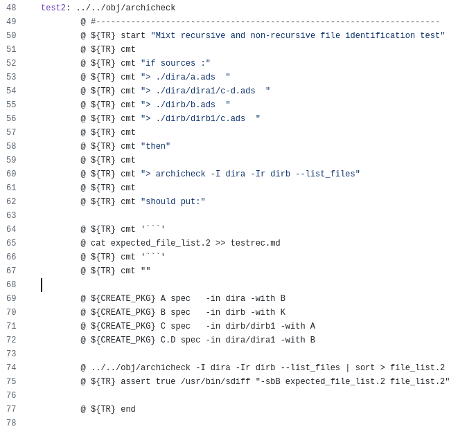

<!-- color: navy -->

---
# Annexes

---
# <!-- fit --> tres tres tres tres tres tres tres long long long titre 
# <!-- fit --> Gros titre
# Gros titre (sans "fit")

<!-- _backgroundColor: palegreen -->
<!-- _color: navy -->

<!-- 
-->

---
# Difference between Gherkin and bbt 1/2

<small>

Gherkin | bbt
------|-----
One feature per file | Zero, one or more feature per file. The only constraint : there should be at least one scenario 
Max one background per feature, apply to every scenario | Idem, and also a background per document (apply to each feature) ==> meaning that there may be two background per scenario    
Tags apply to feature, scenario and background | Tags apply also to steps
Tags have the "@tag" syntax, and must be provided on the line before | Tags are whatever string, and must be in the feature/scenario/step/etc. line  

</small>

---
# Difference between Gherkin and bbt 2/2

<small>

BDD | Test use 
------|-----
A scenario should focus on a single behavior, and so multiple *when* should be avoided | A non regression test should make explicit the chain of user action leading to the problem, and so there will be a sequence of *when* 
Sequence of *when*/*then*/*when*/*then* should be split in several scenarios| See above

</small>

# Short version : bbt is more flexible

# <!-- fit --> Where does bbt come from?  

* Maintenance of `Archicheck` tests was becoming... uncomfortable
* The generated doc is a rewrite of the real input, real command run and real expected results
* Depends on sort, sdiff, and an Ada test utility
* :arrow_right: About 3 500 lines of Makefile of this kind

<!-- 
From the make file, I call a "Test_Report" utility, aliased TR here.
The test has a classical structure, with setup / run / assert.
This utility produce a nice Markdown file, but the content has no more value than whatever comment : input files, run command and output files are copy of the real one. 
-->

---
# bbt was designed to make my life easier
* **Test First** is my favorite way to **design** and **document**

* **I'm lazy**, I hate writing the things twice, and I hate wasting time making what could be done better and quicker by tools

* **I don't remember what I have learned 6 months ago**, I don't remember how my own code works, I don't remember my own utilities features.
  I need a **simple** tool with... no learning curve!

* I want the results of tests to be generated as a Markdown file that can be directly inserted in the documentation

<!-- 
1. note that test first is not about test. It means for me starting by writing some description. Not code. And not even test code. Description
   
2. Lazy : for example writing a test doc that repeats what's in the specification or in the user guide, or writing test scripts that repeats what's in the test plan, or writing comments in the that repeat things that are elsewhere.
-->
    

---

## <!-- fit --> What is a "bbt document"?
1) A normal markdown file
2) Embedding Gherkin descriptions using the MDG (Markdown in Gherkin) format
3) With steps written in english 
   :arrow_right: **this is where the magic is**

<!-- 
1. Meaning, minimal constraint on documentation. Markdown format is an easy choice for me. Kind of literate testing?
-->

