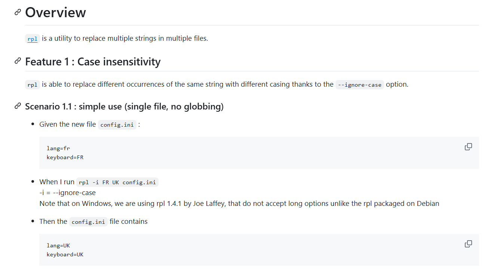
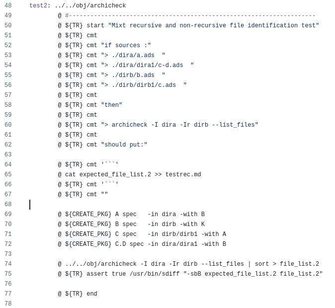

<!-- color: navy -->
# Using natural language for test specification, is that really wise:question:
# 

# An introduction to bbt

---

## Part 1 : [Introduction to bbt](#please-install-bbt-now)
####  Part 2 : [Shallow Parsing](#part-2--shallow-parsing)
####  Part 3 : [Surviving an ambiguous world](#example-of-ambiguity-detected-by-bbt)

---

# Introduction to bbt

---
## Please install bbt now! 

(We will use it during the presentation) 

- Stable version
  ~~~sh
  alr install bbt
  ~~~

- Latest version, AppImage
https://github.com/LionelDraghi/bbt#installation

<!-- 
1. test first is not about test
2. Lazy : for example writing a test doc that repeats what's in the specification or in the user guide, or writing test scripts that repeats what's in the test plan, or writing comments in the that repeat things that are elsewhere.
-->

---
## Whoami

### Lionel Draghi

<small>

- 15 years as Ada software developper
- Retired from software dev in 2007
- Author of softwares that no one uses: Archicheck, smk
  (https://github.com/LionelDraghi)
- And author of bbt, which, by comparison, made a thunderous debut with 3 contributors and the Ada Crate of the Year award!

</small>

<!-- 
While you install the software, I'll continue with the least important part of the presentation
I used to be a senior software developer, I am now much more a senior than a software developper.
-->

---

## What is bbt?
* `bbt` is a dead-simple tool to test your command line apps.

* From an external point of view, it looks like `bbt` is executing the test documentation

* Typical use case : Apps reading some input, and writing some output...
  That is, a **vast majority of command line apps and utilities!**

<!-- 
To get it more concrete, I propose to make a first demo.
-->

---

# Live demo - Getting started

<!-- 
1. check that bbt is in your PATH
1. creation d'un repertoire + fichier demo.md
2. creation test git --version
-->

---

## <!-- fit --> What is a "bbt document"?
1) A normal markdown file
2) Embedding Gherkin descriptions using the MDG (Markdown in Gherkin) format
3) With steps written in english 
   :arrow_right: **this is where the magic is**

---

# <!-- fit --> Live demo 2 - L   et's create a runnable User Guide 
<!-- 
- Let's ask to some LLM :
> could you write a simple user guide for the rpl utility (string replace), with some use examples, in markdown, with a toc, some table and a mermaid diagram?
- [backup file](./rpl_ug.md)
- paste dans vscode, vision en markdown
- run avec bbt, ne doit rien faire
- transformation des exemples en script bbt
- run du test !
-->

---

# <!-- fit --> bbt Give back to documentation its rightful importance! 

And then just 

# #runthedoc

---

#### Part 1 : [Introduction to bbt](#please-install-bbt-now)
##   Part 2 : [Shallow Parsing](#part-2--shallow-parsing)
#### Part 3 : [Surviving an ambiguous world](#example-of-ambiguity-detected-by-bbt)

---
## A word on Shallow parsing (aka Partial parsing)

In the NLP field, **Shallow parsing**, also known as **light parsing** or **chunking**, occupies a position between simple tokenization and full syntactic parsing.
- deep parsing and understanding is not always needed (or even possible)
- shallow parsing is simpler and faster, but possibly ambiguous and not precise

---
## <!-- fit --> Shallow parsing is based on word spotting

<small> 

Example: *Eliza* (1966), the famous psychotherapist emulator

* The logic behind may be as simple as
  ~~~Ada
  if Answer.Contains ("you") then
     Ask ("You're not really talking about me, are you?");

  elsif Answer.Start_With ("no") then
     Ask ("Why not?");
  ...

  else
     Ask ("I see.");
  ~~~
* But it can still be very wise
  ~~~Ada
  elsif Answer.Contains ("rust") then   
     Ask ("What's your problem with Ada???");
  ~~~

</small>

---

## bbt simplified implementation (1/3)

<small> 

**Consider the step :**
~~~md
- Given there is no existing `.config` file
~~~

1) **Tokenization**
   Given | there | is | no | existing | `` `.config` `` | file
   ------|-------|----|----|----------|-----------------|-----
   keyword|*ignored*|keyword|keyword|*ignored*|parameter|keyword

2) No real **Part_Of_Speech tagging**  
But verbs have a special role : **is, run, contains, get, matches...**
Nouns : **file, directory, output, error...**
Adjectives or determiners : **new, no, not...** 

</small>

<!-- 
1. the no need for Part of Speech Tagging. In the code, there are subtypes of the token enums named adjectives, preposition, etc. 
But actually The only phrase that need to be identify is the verb phrase
2. And that's because of the chunking
-->

---
## bbt simplified implementation (2/3)

<small> 

3) **Chunking** 
Very simple in bbt, always the same chunks in the same order: 
before the verb, it's the subject chunk, after the verb it's the object chunk.

   Chunk: | Preposition | Subject phrase | *Subject parameter* | Verb phrase | object phrase | *Object Parameter*
   -------|-------------|----------------|---------------------|-------------|---------------|--------------------
   Token: | *Given*     |                |                     | *Is_No*     | *File_Name*   | *.config*

</small>

<!-- 
Parameters, between backticks in Markdown, are easy to identify (`` `.config` ``)
For french people, beware of the false friend : verb phrase means groupe verbal 
-->

---
## bbt simplified implementation (3/3)

<small> 

4) **Grammar** 
   The Grammar is a table of actions indexed by (preposition, Subject, Verb, Object...)
   
   For example here : 
   ~~~Ada
   Grammar (Preposition => Given, Verb => Is_No, Obj_Attrib => File, ...) := Setup_No_File; 
   ~~~
   Note : you can display the grammar with `bbt lg` (or `bbt list_grammar`)
   
1) The Action and the parameters are stored in a Tree that represent a bbt document (that is a list of features containing a list of scenarios, etc.) 
   ~~~Ada
   Setup_No_File (Subject_Param => "", Object_Param => ".config");
   ~~~

</small>

<!-- 
-->

---
## Current State
- Token : less than 40
- Grammar definition : about 50 lines 
- 640 SLOC of code for lexing and parsing 

Not at all a code I am proud of yet (could be easier to read and more robust), but it is able to "understand" sentences like :
~~~
- Then the resulting `log.txt` file does not contain any `Error:`
~~~

---

#### Part 1 : [Introduction to bbt](#please-install-bbt-now)
#### Part 2 : [Shallow Parsing](#part-2--shallow-parsing)
##   Part 3 : [Surviving an ambiguous world](#example-of-ambiguity-detected-by-bbt )

---
## Example of Ambiguity detected by bbt

~~~md
- given there is no `config` file in the current directory
~~~
:bomb: In the Object chunk, there is both `file` and `directory` keywords...

~~~md
- then the output contains what is in the file `simple.ads`. 
~~~
:bomb: two verbs `contains` and `is`...

### May be detected because both word are in bbt's vocabulary

<!-- 
-->

---
## Worst case example : bbt understand the opposite of what is said

~~~md
- then the output never contains `Error`
~~~

:bomb: `never` is not a keyword, this will indeed check that the output contains `error`

### Can't be detected because one of the word is ignored by bbt

<!-- 
-->

---

## In practice, error are very unlikely

* At test creation, it means that you didn't check the real output
* If the test exists and is OK, this is a "only" a documentation problem

<!-- 
-->

---
# <!-- fit --> Not a problem in real life, if you stick to usual good specification practices 

* Be clear and concise
- Avoid double negation
- Be consistent, don't innovate on formulations (yes, **repeat yourself**! :smile:)
- etc.
* Put complex comments on separate lines, not in the steps
* Uses `bbt explain` in case of doubt

:pen:

<!-- 
-->

---

### Many thanks to the early contributor

- Paul   (https://github.com/pyjarrett)
- Manuel (https://github.com/mgrojo/coap_spark)
- Simon  (https://github.com/simonjwright/ada_caser)

### Many thanks to AdaCore for awarding bbt Crate of the word 2024

##### Slides made with marp https://marp.app/

<!-- 
-->

---
# <!-- fit --> Q & MA
# (Questions and Maybe Answers)

---
# Annexes

---
# <!-- fit --> tres tres tres tres tres tres tres long long long titre 
# <!-- fit --> Gros titre
# Gros titre (sans "fit")

<!-- _backgroundColor: palegreen -->
<!-- _color: navy -->

<!-- 
-->

---
# Difference between Gherkin and bbt 1/2

<small>

Gherkin | bbt
------|-----
One feature per file | Zero, one or more feature per file. The only constraint : there should be at least one scenario 
Max one background per feature, apply to every scenario | Idem, and also a background per document (apply to each feature) ==> meaning that there may be two background per scenario    
Tags apply to feature, scenario and background | Tags apply also to steps
Tags have the "@tag" syntax, and must be provided on the line before | Tags are whatever string, and must be in the feature/scenario/step/etc. line  

</small>

---
# Difference between Gherkin and bbt 2/2

<small>

BDD | Test use 
------|-----
A scenario should focus on a single behavior, and so multiple *when* should be avoided | A non regression test should make explicit the chain of user action leading to the problem, and so there will be a sequence of *when* 
Sequence of *when*/*then*/*when*/*then* should be split in several scenarios| See above

</small>

# Short version : bbt is more flexible

# <!-- fit --> Where does bbt come from?  

* Maintenance of `Archicheck` tests was becoming... uncomfortable
* The generated doc is a rewrite of the real input, real command run and real expected results
* Depends on sort, sdiff, and an Ada test utility
* :arrow_right: About 3 500 lines of Makefile of this kind

<!-- 
From the make file, I call a "Test_Report" utility, aliased TR here.
The test has a classical structure, with setup / run / assert.
This utility produce a nice Markdown file, but the content has no more velue than whatever comment : input files, run command and output files are copy of the real one. 
-->

---
# bbt was designed to make my life easier
* **Test First** is my favorite way to **design** and **document**

* **I'm lazy**, I hate writing the things twice, and I hate wasting time making what could be done better and quicker by tools

* **I don't remember what I have learned 6 months ago**, I don't remember how my own code works, I don't remember my own utilities features.
  I need a **simple** tool with... no learning curve!

* I want the results of tests to be generated as a Markdown file that can be directly inserted in the documentation

<!-- 
1. note that test first is not about test. It means for me starting by writing some description. Not code. And not even test code. Description
   
2. Lazy : for example writing a test doc that repeats what's in the specification or in the user guide, or writing test scripts that repeats what's in the test plan, or writing comments in the that repeat things that are elsewhere.
-->
    

---

# The design principle  

* **Put things in the right order**
  Doc should be **the** source of truth. Tests should come from it, not the other way round.
    
* **Whatever the documentation**, specifications, acceptance test, user guide, readme file... They are all valid source of truth. 

* **Don't repeat yourself**
  Neither in documentation, nor in code.

* **Don't repeat yourself**
  Don't.

<!-- 
1. Meaning, minimal constraint on documentation. Markdown format is an easy choice for me. Kind of literate testing?
   
-->

---

In one word 

# <!-- fit --> bbt Make Documentation Great Again! 

