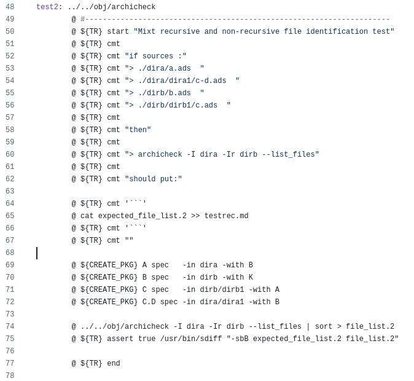

<!-- color: navy -->

# Using natural language for test specification, is that really wise?
# 

# An introduction to bbt
# 

# <!-- fit --> Lionel Draghi - Ada Developers Workshop - 13 June 2025

---

<!-- footer: "Lionel Draghi - AEiC 2025 / Ada Developers Workshop - 13 june 2025" -->

# Agenda
## Part 1 - Introduction to bbt
## Part 2 - Partial Parsing
## Part 3 - Surviving an ambiguous world
## Conclusion

---

<!-- header: "**[Introduction to bbt](#part-1---introduction-to-bbt-1)** | [Partial parsing](#part-2---partial-parsing-1) | [Surviving an ambiguous world](#part-3---surviving-an-ambiguous-world-1) | [Conclusion](#conclusion-1)" -->

# Part 1 - Introduction to bbt

---

## Feel free to install bbt now! 

- Stable version
  ~~~sh
  alr install bbt
  ~~~

- Latest version, AppImage
https://github.com/LionelDraghi/bbt#installation

# 

(And if my presentation is boring : `bbt ct` create a file containing a short tutorial!)
<!-- 
-->

---

## Whoami

### Lionel Draghi

<small>

- 15 years as Ada software developer
- Retired from software dev in 2007
- Author of Archicheck and smk
  (https://github.com/LionelDraghi), brilliant apps that no one uses
- but whose merit is being the origin of the creation of bbt

</small>

<!-- 
While you install the software, I'll continue with the least important part of the presentation
I used to be a senior software developer, I am now much more a senior than a software développer.
I am the author of those brilliant and useless software, whose merit will have been to give rise to BBT.

Will bbt be another tombstone in the middle of the giant software graveyard that is GitHub?
Let's see that together.
-->

---

## What is bbt?

- `bbt` is a dead-simple tool for _black box_ testing your command line apps 
  (**not unit or integration testing**)

* It targets Apps reading some input and writing some output, like for example `grep` or `gcc` 

* `bbt` inputs are markdown files, embedding descriptions of an expected behavior in Gherkin format, **with the steps in natural language** 

* From a practical point of view, you really run the doc : `bbt my_spec.md`

<!-- 
So this is the story of an experiment that turn to actually be useful.

Not suitable for all test cases, but who has never had to test an CLI app?

The rest will be easier if you have an initial idea of what the tool is, so let's start right away with a demo.
-->

---

# Live demo - Getting started

<!-- 
1. check that bbt is in your PATH
1. creation d'un repertoire + fichier demo.md
1. lancer bbt avant qu'il y ait un scenario dans le fichier
1. lancer bbt avant qu'il y ait un step
1. creation test grep --version
1. feature Case sensitivity
1. creation scenario test grep Rose flower.list
2. rerun pour montrer --yes
3. creation example  test grep -i Rose flower.list
4. --cleanup
-->

---

## Where does bbt come from?

<small>

- acc and smk are CLI apps, mostly tested with black box testing
* Initially Easy to do within a Makefile
* Started to become complex and error-prone when adding the documentation generation
* And did not prevent discrepancies between the generated documentation and what is really run.
  For example here : documented command line (line 60) vs really run (line 74)

</small>

<!-- 
The inconsistencies are an epidemic in the software world, sometimes with benign effects (e.g., an error in an example), and sometimes with more serious consequences.
Why is it so? Because the truth of our software is in the User Guide, is in the sources comments, is in the tests definition, etc. 
Initially, behavior is defined in some docs, and further refined in tests description. 
But quickly, the tests evolve independently because the developer is focused on them, and they end up contradicting the readme file or the user guide.
Truth is a complex distributed system!
All systems end up with discrepancies, because we, developers, are mostly focused on tests and code. But we have no easy way to check that the whole existing documentation is compliant with the latest state of the software. 
For example, examples in the user guide, are they up to date?

If it's true for literate programming, it's also true for testing.
-->

---
## Design principles

<small>

* **The documentation is the _single source of truth_** 
  **_Single_**: _Never repeat yourself_
  **_Source_**: Tests comes from documentation, not the other way around
  **_Truth_**: If it says that the app is run with that command line, then it is!

## 

    
* **Whatever the documentation**
  Specifications, acceptance test, user guide, readme file... 
  They are all valid source of truth
 
## 

    
* **Do not let tests implementation details show through in the documentation**

</small>

<!-- 
source of truth : literally, that is not just "doc as code", but "doc is code", a kind of literate testing

Whatever the doc : Even those slides, written in Markdown using Marp, are a valid source of truth
-->

---

# <!-- fit --> Live demo 2 - Let's create a runnable README file 

<!-- 
- Let's ask to some LLM :
> could you write a simple user guide for the rpl utility (string replace), with some use examples, in Markdown, with a toc, some table and a mermaid diagram?
- [backup file](./rpl_ug.md)
- paste dans vscode, vision en markdown
- run avec bbt avant modifs
- transformation des exemples en script bbt
- run du test !
-->

---

<!-- header: "[Introduction to bbt](#part-1---introduction-to-bbt-1) | **[Partial parsing](#part-2---partial-parsing-1)** | [Surviving an ambiguous world](#part-3---surviving-an-ambiguous-world-1) | [Conclusion](#conclusion-1)" -->

# Part 2 - Partial Parsing

---

## A word on Partial parsing

# 

In the NLP field, **partial parsing**, also known as **shallow parsing**, **light parsing** or **chunking**, occupies a position between simple tokenization and full syntactic parsing.
- Deep parsing and understanding can be complex and is not always necessary
- Shallow parsing is simpler and faster
- However, it may be ambiguous and lack precision

---

## <!-- fit --> Shallow parsing is based on word spotting

<small> 

Example: *Eliza* (1966), the famous psychotherapist emulator

* The logic behind may be as simple as
  ~~~Ada
  if Answer.Contains ("you") then
     Ask ("You're not really talking about me, are you?");

  elsif Answer.Start_With ("no") then
     Ask ("Why not?");
  ...

  else
     Ask ("I see.");
  ~~~
* But nevertheless very wise
  ~~~Ada
  elsif Answer.Contains ("rust") then   
     Ask ("What's your problem with Ada?");
  ~~~

</small>

---

## Consider those bbt steps:

  ~~~
  - Given there is no existing `.config` file
  - When I run `my_app --init` 
  - Then there is a `.config` file
  - And the file `.config` contains `autosave = true`
  ~~~

# 

## It may seem complex at first glance, but is it?

---

<small> 

**The same steps :**
~~~md
- Given   there                is no      existing `.config` file
- When    I                    run        `my_app --init` 
- Then    there                is         a `.config` file
- And     the file `.config`   contains   `autosave = true`
~~~

- All sentences have the same simple structure, in the same order
  **preposition + subject phrase + verb phrase + object phrase**

* The Markdown syntax is helping : parameters are between backticks, no possible confusion with keywords

* A small lexicon: about 20 keywords to build all the possible sentences

* And very repetitive sentences! 

* ### In fact, it's a fairly simple use case for partial parsing 

</small>

<!-- 
no need for NER (Named Entity Recognition)
-->

---

## bbt implementation (1/4) : Tokenization

# 

<small> 

**Consider the step :**
~~~gherkin
- Given there is no existing `.config` file
~~~

# 

**Tokenization**

  |  Given  |  there  |    is   |    no   | existing | `` `.config` `` |  file   |
  |:-------:|:-------:|:-------:|:-------:|:--------:|:---------------:|:-------:|
  | keyword |    -    | keyword | keyword |    -     |     parameter   | keyword |

</small>

<!-- 
1. the no need for Part of Speech Tagging. In the code, there are subtypes of the token enums named adjectives, preposition, etc. 
But actually The only phrase that need to be identify is the verb phrase
2. And that's because of the chunking
-->

---

## bbt implementation (2/4) : Chunking

<small> 

Before the verb, it's the subject chunk, after the verb it's the object chunk.

And if it's a Markdown code span (or a code block), it's a parameter.

# 

| Preposition | Subject phrase | *Subject parameter* | Verb phrase | object phrase | *Object Parameter*
|:-----------:|:--------------:|:-------------------:|:-----------:|:-------------:|:------------------:
| *Given*     |                |                     | *Is_No*     | *File_Name*   | *.config*

</small>

<!-- 
Parameters, between backticks in Markdown, are easy to identify (`` `.config` ``)
For french people, beware of the false friend : verb phrase means groupe verbal 
-->

---
## bbt implementation (3/4) : Grammar

<small> 

The Grammar is a table of actions indexed by (preposition, Subject, Verb, Object...)
   
For example here : 
~~~Ada
Grammar (Preposition => Given, Verb => Is_No, Obj_Attrib => File, ...) := Setup_No_File; 
~~~

# 

* Note : you can display the grammar with `bbt lg` (or `bbt list_grammar`)

</small>

<!-- 
-->

---
## bbt implementation (4/4) : Actions

<small> 

* The action and the parameters are stored in a Tree that represent a bbt document (that is a list of features containing a list of scenarios, containing etc.) 

* When all documents are parsed, a runner walk through and run actions in sequence.
  Could be:
  ~~~Ada
  Setup_No_File (Subject_Param => "", Object_Param => ".config");
  ~~~

# 

* Wan't to know what will be done? 
  There is a dry run mode: `bbt ex` (or `bbt explain`)

</small>

<!-- 
-->

---
### Current State
- Token: less than 40
- Grammar definition: about 50 lines 
- Total lines of code for lexing and parsing: 640

## 

### WIP! The code could be simpler, easier to read and more robust...

## 

### But it is able to "understand" sentences like:
~~~
- Then the resulting `log.txt` file does not contain any `Error:`
~~~

<!-- 
And this is making me happy!

But before concluding that bbt is a success, let's face the ambiguity question.
-->
---

<!-- header: "[Introduction to bbt](#part-1---introduction-to-bbt-1) | [Partial parsing](#part-2---partial-parsing-1) | **[Surviving an ambiguous world](#part-3---surviving-an-ambiguous-world-1)** | [Conclusion](#conclusion-1)" -->

# Part 3 - Surviving an ambiguous world

---

<small>

* Example of a detected Ambiguity
  ~~~md
  - given there is no `config` file in the current directory
  ~~~

  * :bomb: In the Object chunk, there is both `file` and `directory` keywords...
  * May be detected because both word are in bbt's vocabulary

# 

* Example of an undetected ambiguity, where bbt understand the opposite of what is said!
  ~~~md
  - then the output never contains `Error`
  ~~~

  * :bomb: `never` is not a keyword, this will indeed check that the output contains `error`
  * Can't be detected because `never` is ignored by bbt

</small>

<!-- 
-->

---

## In practice, it's very unlikely if... 

* you stick to the usual best practices for writing specifications: 
  - Be clear and **concise**, avoid double negation, be consistent (don't innovate on formulations), etc.

* Plus:
  - Put complex comments on separate lines, not in the steps
  - Check at least once the real output!!
  - Uses `bbt explain` in case of doubt

* And why not add a feature to rewrite the steps in a standardized way? (`bbt rewrite scenario.md`)

<!-- 
But the challenge is still open: find a more serious error case and be awarded!
-->

---

<!-- header: "[Introduction to bbt](#part-1---introduction-to-bbt-1) | [Partial parsing](#part-2---partial-parsing-1) | [Surviving an ambiguous world](#part-3---surviving-an-ambiguous-world-1) | **[Conclusion](#conclusion-1)**" -->

<small>

# Special thanks

* ### to AdaCore 

   - :heart: For awarding bbt __Ada Crate of the word 2024__ (https://blog.adacore.com/)

# 

* ### to the early adopters and contributors

   - :heart: Paul   (https://github.com/pyjarrett)
   - :heart: Manuel (https://github.com/mgrojo/coap_spark)
   - :heart: Simon  (https://github.com/simonjwright/ada_caser)

</small>

<!-- 
As a conclusion, bbt seems to be a useful tools, and i don't see for now any drawback in using it.
I hoppe you'll give it a try, and that you'll find it useful too.
-->

---

# Conclusion

# 

Ideas and features are welcome https://github.com/LionelDraghi/bbt/discussions 

# 

<small>

Slides made with [Marp](https://marp.app/) available here https://github.com/LionelDraghi/bbt/blob/main/docs/bbt_presentation/

</small>

<!-- 
As a conclusion, bbt seems to be a useful tools, and i don't see for now any drawback in using it.
I hoppe you'll give it a try, and that you'll find it useful too.

Everything is open to discussion, so feel free to contribute your ideas and features.
-->

---

# 

# Q & A

# 

<!-- 
-->

