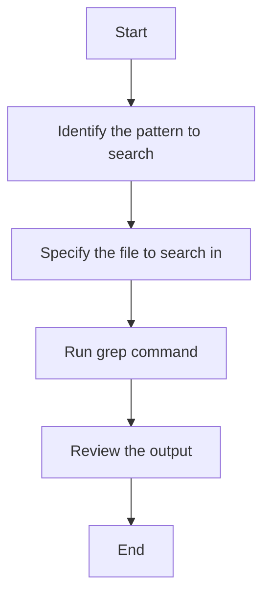

# User Guide for the `grep` Utility

## Table of Contents
1. [Introduction](#introduction)
2. [Installation](#installation)
3. [Basic Usage](#basic-usage)
4. [Common Options](#common-options)
5. [Examples of Use](#examples-of-use)
6. [Diagram](#diagram)

## Introduction
`grep` is a command-line utility for searching plain-text data sets for lines that match a regular expression. Its name comes from the command `g/re/p` (globally search for a regular expression and print matching lines), which was used in the early Unix text editor `ed`.

## Installation
`grep` is typically pre-installed on Unix-like operating systems. If it's not installed, you can install it using your system's package manager. For example, on Debian-based systems like Ubuntu, you can use:

```bash
sudo apt-get install grep
```

## Basic Usage
The basic syntax for `grep` is:

```bash
grep [options] pattern [file...]
```

- `options`: Optional flags that modify the behavior of `grep`.
- `pattern`: The regular expression you want to search for.
- `file`: The file(s) you want to search in. If no file is specified, `grep` reads from standard input.

## Common Options

| Option | Description |
|--------|-------------|
| `-i`   | Ignore case distinctions in both the pattern and the input files. |
| `-v`   | Invert the sense of matching, to select non-matching lines. |
| `-c`   | Suppress normal output; instead print a count of matching lines for each input file. |
| `-n`   | Prefix each line of output with the 1-based line number within its input file. |
| `-r`   | Recursively search subdirectories listed. |

## Examples of Use

### Example 1: Basic Search
To search for the word "example" in a file named `file.txt`, use:

```bash
grep "example" file.txt
```

### Example 2: Case-Insensitive Search
To perform a case-insensitive search for the word "example" in `file.txt`, use:

```bash
grep -i "example" file.txt
```

### Example 3: Recursive Search
To recursively search for the word "example" in all files within the current directory and its subdirectories, use:
- Given the new dir `dir1`
- And   the new dir `dir2\dir3`
- And   the file `dir1/list1` containing `Rose`
- And   the file `dir2/dir3/list2` containing 
  ```
  Rose
  Cactus
  Tulip
  ```

- When I run `grep -r "Rose" .`

- Then I shall get 
```
dir1/list1
```

## Diagram

Here's a simple Mermaid diagram illustrating the basic workflow of using `grep`:



This diagram provides a high-level overview of the steps involved in using `grep` to search for patterns in files.
