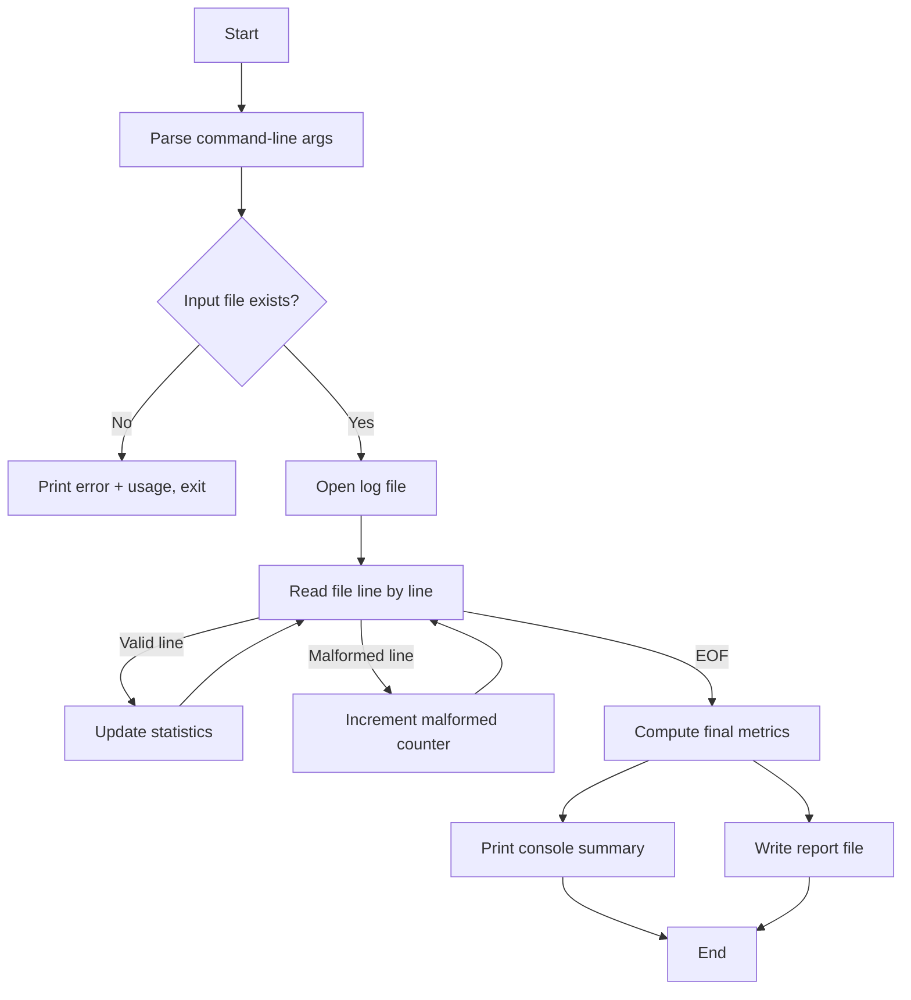

## CS 215 – Data Processing and Algorithms  
### Group Programming Assignment #1: Log File Analyzer (`weblogstat`)

**Due date:** Friday, October 18, 11:59 PM  
**Group size:** 3–4 students  
**Weight:** 12% of final grade  

---

### 1. Overview


You will implement a **command-line Log File Analyzer** called **`weblogstat`** (no GUI).

Your program will:

- Read a **web server log file** from disk  
- Compute basic statistics  
- Print a **summary** to standard output  
- Write a **detailed report** to a text file  

This document, provided under the name **`cs215_assignment.md`**, also serves as the **official public test suite** for your `weblogstat` executable:

- The instructor will run:
  ```bash
  bbt cs215_assignment.md
  ```
  to evaluate the **`weblogstat` public test suite** part of your grade.
- **You must not modify** this file. Any changes to `cs215_assignment.md` will be ignored for grading.

In addition to these public tests, the instructor will also run **hidden robustness tests** (not included in this file) on your `weblogstat` implementation.

You are **strongly encouraged** to design your **own additional tests** (extra log files and BBT test files), but these must be stored in **separate files** (for example: `cs215_extra_tests_<group>.md`). You can then run them with:

```bash
bbt cs215_assignment.md
bbt cs215_extra_tests_<group>.md
```

This allows you to experiment and add robustness tests **without modifying** the official assignment file.

---

### 2. Program Behavior

Your program must be executable from the command line as:

```bash
weblogstat <input_log_file> [--output <output_file>]
```

- `<input_log_file>`: required, path to the log file  
- `--output <output_file>`: optional; default output file name is `report.txt`  

#### 2.1 Input Format (Log File)

Each line of the log file has the form:

```text
2024-09-21T13:45:22Z 192.168.0.1 GET /index.html 200 123ms
```

Fields (space-separated):

1. `timestamp` (string)  
2. `ip_address` (string)  
3. `method` (e.g., `GET`, `POST`)  
4. `path` (e.g., `/index.html`)  
5. `status_code` (integer)  
6. `response_time` (integer with `ms` suffix, e.g., `123ms`)  

You must assume:

- The file may contain **tens of thousands of lines**.  
- Some lines may be **malformed** (missing fields, non-integer status code, invalid response time, etc.).  
- Malformed lines must be **ignored** in all statistics, but **counted** in a separate “Malformed lines” counter.

#### 2.2 Console Output (Standard Output)

After processing the file, print a summary to standard output **exactly** in this format:

```text
Total requests: <number>
Unique IP addresses: <number>
Successful requests (2xx): <number>
Client errors (4xx): <number>
Server errors (5xx): <number>
Most requested path: <path> (<count> requests)
Slowest average path: <path> (<avg_response_time_ms> ms)
Malformed lines: <number>
```

Notes:

- If there are **no valid requests** (all lines malformed), you must still print all lines above with `0` for all counts and `Malformed lines: <number>`.  
- In that case, use a consistent placeholder for `Most requested path` and `Slowest average path` (e.g., `N/A (0 requests)` and `N/A (0 ms)`), as shown in the tests.

#### 2.3 Output File (Report)

Write a **detailed report** (plain text) to the output file (default: `report.txt`, or the path provided with `--output`).

The report must contain at least:

1. A **header** with:
   - The input file name  
   - The date/time of analysis  

2. The same **summary** as printed to the console (same numbers).  

3. A **Top 5 IP addresses** section.  

4. A **Top 5 paths** section (by number of requests).  

5. The **percentage of requests** for each status code class:

   - 2xx (successful)  
   - 3xx (redirection)  
   - 4xx (client errors)  
   - 5xx (server errors)  

Percentages should be computed over all **valid** requests (excluding malformed lines).  
The exact layout of the report is flexible, but it must be **readable and structured**.

---

### 3. Constraints and Implementation Requirements

- Language: **Python 3** (or as specified by the instructor)  
- **No GUI** libraries; command-line only.  
- Use only the **standard library** (no external log-parsing or statistics libraries).  
- Process the input file **line by line** (do not read the entire file into memory at once).  
- Handle errors **gracefully**:
  - Missing input file  
  - Invalid command-line arguments  
  - Unreadable files (permissions, etc.)

Your code should be **modular**, with separate functions (and possibly classes) for:

- Parsing a log line  
- Updating statistics  
- Computing final metrics (percentages, averages)  
- Printing the console summary  
- Writing the detailed report  

Example high-level structure (Mermaid):



---

### 4. Automated Testing with `bbt`  

The instructor will use **`bbt`** to run automated tests on your `weblogstat` program.

- This document (`cs215_assignment.md`) contains the **official `weblogstat` public test suite**.  
- You can check your implementation against the public tests with:
  ```bash
  bbt cs215_assignment.md
  ```
- **Do not modify** `cs215_assignment.md`. Grading will always be done against the original version provided by the instructor.

You are **encouraged** to add your own extra tests in **separate BBT files** (for example `cs215_extra_tests_<group>.md`) and run them regularly:

```bash
bbt cs215_extra_tests_<group>.md
```

Additional **hidden robustness tests** (not in any student-provided file) will also be run after submission.

For the complete definition of the `bbt` test format and options, refer to the official repository:  
<https://github.com/LionelDraghi/bbt>

---

## 4.1 `weblogstat` public test suite (version révisée)

> Reminder: you can run all these tests with:  
> `bbt cs215_assignment.md`

---

### Feature: Basic statistics on valid logs

#### Scenario: Compute counts and top paths on a small valid log
- Given the new file `log.1` with the following content
```
2024-09-21T13:45:22Z 192.168.0.1 GET /index.html 200 123ms
2024-09-21T13:45:24Z 192.168.0.2 GET /products.html 200 98ms
2024-09-21T13:45:25Z 192.168.0.1 POST /checkout 500 321ms
2024-09-21T13:45:26Z 192.168.0.3 GET /index.html 404 210ms
```
- When I run `weblogstat log.1`
- Then the command should complete with no error
- And the output is
```
Total requests: 4
Unique IP addresses: 3
Successful requests (2xx): 2
Client errors (4xx): 1
Server errors (5xx): 1
Most requested path: /index.html (2 requests)
Slowest average path: /checkout (321 ms)
Malformed lines: 0
```

---

### Feature: Handling malformed lines

#### Scenario: Ignore malformed lines but count them in the summary
- Given the new file `log.2` with the following content
```
MALFORMED LINE WITHOUT ENOUGH FIELDS
2024-09-21T13:45:22Z 10.0.0.1 GET /ok 200 100ms
2024-09-21T13:45:23Z 10.0.0.2 GET /ok 200 200ms
2024-09-21T13:45:24Z 10.0.0.3 GET /bad_status abc 300ms
2024-09-21T13:45:25Z 10.0.0.4 GET /ok 500 notams
```
- When I run `weblogstat log.2`
- Then the command should complete with no error
- And the output is
```
Total requests: 3
Unique IP addresses: 3
Successful requests (2xx): 2
Client errors (4xx): 0
Server errors (5xx): 1
Most requested path: /ok (3 requests)
Slowest average path: /ok (267 ms)
Malformed lines: 2
```

#### Scenario: All lines malformed results in zero statistics and correct malformed count
- Given the new file `log.3` with the following content
```
BAD LINE
ALSO BAD
2024-09-21T13:45:22Z MISSING_FIELDS
INVALID 10.0.0.1 GET /ok 200
```
- When I run `weblogstat log.3`
- Then the command should complete with no error
- And the output is
```
Total requests: 0
Unique IP addresses: 0
Successful requests (2xx): 0
Client errors (4xx): 0
Server errors (5xx): 0
Most requested path: N/A (0 requests)
Slowest average path: N/A (0 ms)
Malformed lines: 4
```

---

### Feature: Command-line arguments and error handling

#### Scenario: Missing input file shows error and usage
- Given there is no `does_not_exist.log` file
- When I run `weblogstat does_not_exist.log`
- Then the command should end with an error
- And the output contains `Error: cannot open input file 'does_not_exist.log'`
- And the output contains `Usage: weblogstat <input_log_file> [--output <output_file>]`

#### Scenario: Use custom output file with `--output`
- Given the new file `log.4` with the following content
```
2024-09-21T13:45:22Z 10.0.0.1 GET /only 200 50ms
```
- Given there is no `result.txt` file
- When I run `weblogstat log.4 --output result.txt`
- Then the command should complete with no error
- And the output is
```
Total requests: 1
Unique IP addresses: 1
Successful requests (2xx): 1
Client errors (4xx): 0
Server errors (5xx): 0
Most requested path: /only (1 requests)
Slowest average path: /only (50 ms)
Malformed lines: 0
```
- And `result.txt` file contains
```
Total requests: 1
Unique IP addresses: 1
Successful requests (2xx): 1
Client errors (4xx): 0
Server errors (5xx): 0
Most requested path: /only (1 requests)
Slowest average path: /only (50 ms)
Malformed lines: 0
```

---

### Feature: Output file content

#### Scenario: Report file contains header, summary, top IPs and top paths
- Given the new file `log.5` with the following content
```
2024-09-21T13:45:22Z 10.0.0.1 GET /a 200 100ms
2024-09-21T13:45:23Z 10.0.0.2 GET /b 200 200ms
2024-09-21T13:45:24Z 10.0.0.1 GET /a 200 300ms
2024-09-21T13:45:25Z 10.0.0.3 GET /c 404 400ms
```
- When I run `weblogstat log.5`
- Then the command should complete with no error
- And the output is
```
Total requests: 4
Unique IP addresses: 3
Successful requests (2xx): 3
Client errors (4xx): 1
Server errors (5xx): 0
Most requested path: /a (2 requests)
Slowest average path: /c (400 ms)
Malformed lines: 0
```
- And `report.txt` file contains
```
Total requests: 4
Unique IP addresses: 3
Successful requests (2xx): 3
Client errors (4xx): 1
Server errors (5xx): 0
Most requested path: /a (2 requests)
Slowest average path: /c (400 ms)
Malformed lines: 0
Top 5 IP addresses:
Top 5 paths:
```

#### Scenario: Report shows correct percentages for status code classes
- Given the new file `log.8` with the following content
```
2024-09-21T13:45:22Z 10.0.0.1 GET /ok 200 100ms
2024-09-21T13:45:23Z 10.0.0.2 GET /redir 302 150ms
2024-09-21T13:45:24Z 10.0.0.3 GET /notfound 404 200ms
2024-09-21T13:45:25Z 10.0.0.4 GET /error 500 250ms
```
- When I run `weblogstat log.8`
- Then the command should complete with no error
- And the output is
```
Total requests: 4
Unique IP addresses: 4
Successful requests (2xx): 1
Client errors (4xx): 1
Server errors (5xx): 1
Most requested path: /ok (1 requests)
Slowest average path: /error (250 ms)
Malformed lines: 0
```
- And `report.txt` file contains
```
2xx: 25%
3xx: 25%
4xx: 25%
5xx: 25%
```

---

### Feature: Robustness and edge cases

#### Scenario: Handle unusual but valid HTTP methods and status codes
- Given the new file `log.6` with the following content
```
2024-09-21T13:45:22Z 10.0.0.1 PUT /resource 201 100ms
2024-09-21T13:45:23Z 10.0.0.2 DELETE /resource 204 150ms
2024-09-21T13:45:24Z 10.0.0.3 PATCH /resource 418 200ms
```
- When I run `weblogstat log.6`
- Then the command should complete with no error
- And the output is
```
Total requests: 3
Unique IP addresses: 3
Successful requests (2xx): 2
Client errors (4xx): 1
Server errors (5xx): 0
Most requested path: /resource (3 requests)
Slowest average path: /resource (150 ms)
Malformed lines: 0
```

---


### 5. Grading

| Component                                                | Points |
|----------------------------------------------------------|:------:|
| **`weblogstat` public test suite** – Scenarios passed    | 45     |
| **`weblogstat` public test suite** – Feature bonuses (no error in all scenarios of a feature) | 10 |
| Hidden `bbt` robustness tests                            | 15     |
| Code quality (structure, readability, comments, modularity) | 20  |
| Report contents and formatting                           | 5      |
| Collaboration evidence (Git history, contributions)      | 5      |
| **Total**                                                | **100**|

#### 5.1 `weblogstat` public test suite – Scenarios (45 pts)

Each **Scenario** in section 4.1 that passes in `bbt` contributes to the **45 points** for public tests. The weight of each scenario can be, for example:

- Basic statistics on valid logs – 1 scenario: **10 pts**  
- Handling malformed lines – 2 scenarios: **8 + 8 = 16 pts**  
- Command-line arguments and error handling – 2 scenarios: **5 + 5 = 10 pts**  
- Output file content – 1 scenario: **5 pts**  
- Robustness and edge cases – 1 scenario: **4 pts**  

#### 5.2 `weblogstat` public test suite – Feature bonuses (10 pts)

For each **Feature** in the public test suite, if **all its scenarios** pass (0 failures in that Feature), the group receives a **bonus**:

| Feature                                      | Bonus |
|----------------------------------------------|:-----:|
| Basic statistics on valid logs               | 2 pts |
| Handling malformed lines                     | 2 pts |
| Command-line arguments and error handling    | 3 pts |
| Output file content                          | 2 pts |
| Robustness and edge cases                    | 1 pt  |

Total possible bonus = **10 points** (capped at 100/100 overall).

