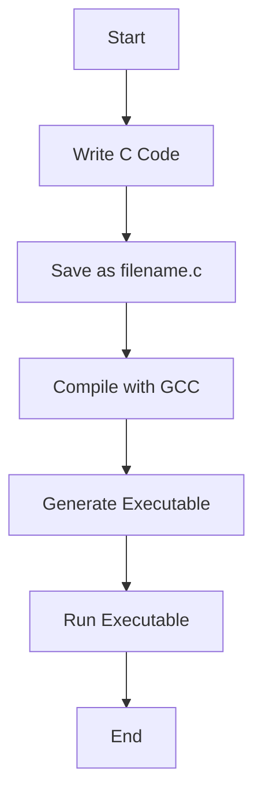

# User Guide for GCC Compilation

## Table of Contents
- [User Guide for GCC Compilation](#user-guide-for-gcc-compilation)
  - [Table of Contents](#table-of-contents)
  - [Introduction](#introduction)
  - [Installation](#installation)
  - [Basic Usage](#basic-usage)
  - [Examples](#examples)
    - [Example 1: Compile a Simple C Program](#example-1-compile-a-simple-c-program)
    - [Example 2: Compile with Optimization](#example-2-compile-with-optimization)
  - [Advanced Options](#advanced-options)
  - [Diagram](#diagram)
  - [Comparison Table](#comparison-table)

## Introduction
GCC (GNU Compiler Collection) is a compiler system produced by the GNU Project supporting various programming languages. This guide will walk you through the basics of compiling C programs using GCC.

## Installation
To install GCC, you can use the following command:

```bash
sudo apt-get install gcc
```

## Basic Usage
The basic syntax for compiling a C program with GCC is as follows:

```bash
gcc [options] filename.c -o outputname
```

- `filename.c`: The name of the C source file.
- `outputname`: The name of the executable file.
- `options`: Various compiler options.

## Examples

### Example 1: Compile a Simple C Program
To compile a simple C program named `hello.c`:

- Given the `hello.c` file
  ```c
  #include <stdio.h>

  int main() {
      printf("Hello, World!\n");
      return 0;
  }
  ```
- When I run `gcc hello.c -o hello`
- Then there is an `hello` file

- When I run `./hello` 
- Then I get `Hello, World!`
  

### Example 2: Compile with Optimization
- Given there is no `optimize` file
- Given the new source file `optimize.c` 
  ~~~c
  #include <stdio.h>

  int main() {
    int sum = 0;
    for (int i = 0; i < 100; i++) {
        sum += i;
    }
    printf("The sum is: %d\n", sum);
    return 0;
  }
  ~~~

- When I successfully run `gcc -O2 optimize.c -o optimize`

To compile a C program with optimization, use:

- Then there is an `optimize` file

- When I successfully run `./optimize`
  
- Then the output is `The sum is: 4950` 


## Advanced Options
Here are some advanced options you can use with GCC:

| Option | Description |
|--------|-------------|
| `-O1`  | Optimize for size and speed. |
| `-O2`  | Optimize more for speed. |
| `-O3`  | Optimize even more for speed. |
| `-Wall`| Enable most warning messages. |
| `-g`   | Include debugging information. |

## Diagram
Here is a simple diagram to illustrate the GCC compilation process:



## Comparison Table
Below is a comparison of GCC with other similar compilers:

| Compiler | Language Support | Optimization Levels | Debugging Support |
|----------|------------------|---------------------|-------------------|
| GCC      | Multiple         | High                | Yes               |
| Clang    | Multiple         | High                | Yes               |
| MSVC     | C, C++           | Medium              | Yes               |
```

This guide provides a basic overview of how to use GCC for compiling C programs. For more detailed information, you can refer to the GCC documentation by running `man gcc` in your terminal.